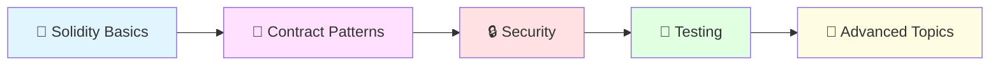

# Smart Contracts 📝🔗

Welcome to the Smart Contracts section! Here you'll learn everything about writing, deploying, and maintaining smart contracts on the Ethereum blockchain and EVM-compatible chains.

## 📚 Learning Path



## 📖 Contents

### 1. [Solidity Basics](solidity-basics.md) 🔤
**Estimated Time**: 45-50 minutes  
**Prerequisites**: Programming basics (JavaScript/Python recommended)

Learn the fundamentals of Solidity programming:
- 📦 Data types and variables
- ⚙️ Functions and modifiers
- 🗺️ Mappings and structs
- 📡 Events and logging
- 🚨 Error handling
- 💰 Building your first token contract

### 2. [Contract Patterns](contract-patterns.md) 🎨
**Estimated Time**: 40-45 minutes  
**Prerequisites**: Solidity Basics

Master essential design patterns:
- 🔐 Access control (Ownable, RBAC)
- 🔄 Checks-Effects-Interactions
- 💸 Pull over Push payments
- 🏭 Factory pattern
- 📚 Registry pattern
- 🔄 Proxy (upgradeability)
- 🚨 Emergency stop
- 🎲 Commit-reveal
- ⚙️ State machines

### 3. [Security Best Practices](security-best-practices.md) 🔒
**Estimated Time**: 50-60 minutes  
**Prerequisites**: Solidity Basics, Contract Patterns

Protect your contracts from vulnerabilities:
- 🚨 Common attack vectors
- 🛡️ Security patterns
- ✅ Security checklist
- 🔍 Audit process
- 🛠️ Security tools

### 4. [Testing Contracts](testing-contracts.md) 🧪
**Estimated Time**: 45-50 minutes  
**Prerequisites**: Solidity Basics

Write comprehensive tests:
- 🧪 Unit testing with Hardhat
- 🔄 Integration testing
- ⛽ Gas optimization testing
- 🎭 Test coverage
- 🤖 Continuous integration

## 🎯 Learning Objectives

By the end of this section, you will be able to:

✅ Write Solidity smart contracts from scratch  
✅ Implement common design patterns  
✅ Identify and fix security vulnerabilities  
✅ Write comprehensive test suites  
✅ Deploy contracts to testnets and mainnet  
✅ Verify and publish contract source code  
✅ Optimize contracts for gas efficiency  

## 🛠️ Development Environment Setup

### Required Tools

1. **Node.js & npm**
```bash
# Install Node.js (v16 or higher)
curl -o- https://raw.githubusercontent.com/nvm-sh/nvm/v0.39.0/install.sh | bash
nvm install node
```

2. **Hardhat** (Recommended)
```bash
npm install --global hardhat
```

3. **MetaMask** 🦊
- Browser extension for wallet management
- [Download MetaMask](https://metamask.io/)

4. **Code Editor**
- VS Code with Solidity extensions
- [Download VS Code](https://code.visualstudio.com/)

### Useful Extensions

- **Solidity** by Juan Blanco
- **Hardhat Solidity** by Nomic Foundation
- **Solidity Visual Auditor** by tintinweb

## 🚀 Quick Start Project

Create your first smart contract project:

```bash
# Create project directory
mkdir my-first-contract
cd my-first-contract

# Initialize Hardhat project
npx hardhat

# Install dependencies
npm install --save-dev @nomiclabs/hardhat-ethers ethers @openzeppelin/contracts

# Create a simple contract
cat > contracts/MyToken.sol << 'EOF'
// SPDX-License-Identifier: MIT
pragma solidity ^0.8.0;

import "@openzeppelin/contracts/token/ERC20/ERC20.sol";

contract MyToken is ERC20 {
    constructor() ERC20("MyToken", "MTK") {
        _mint(msg.sender, 1000000 * 10 ** decimals());
    }
}
EOF

# Compile
npx hardhat compile

# Run tests
npx hardhat test
```

## 📊 Learning Progress Tracker

Track your progress through the smart contracts section:

- [ ] **Week 1: Fundamentals**
  - [ ] Complete Solidity Basics
  - [ ] Build a simple storage contract
  - [ ] Deploy to local testnet
  
- [ ] **Week 2: Patterns & Architecture**
  - [ ] Learn design patterns
  - [ ] Implement access control
  - [ ] Build a token contract
  
- [ ] **Week 3: Security**
  - [ ] Study common vulnerabilities
  - [ ] Practice secure coding
  - [ ] Run security audits
  
- [ ] **Week 4: Testing & Deployment**
  - [ ] Write comprehensive tests
  - [ ] Deploy to testnet
  - [ ] Verify contracts on Etherscan

## 🎓 Hands-On Projects

### Beginner Projects 🌱

1. **Simple Storage** - Store and retrieve data
2. **Todo List** - Manage tasks on-chain
3. **Simple Token** - Create your first ERC-20 token
4. **Crowdfunding** - Basic fundraising contract

### Intermediate Projects 🚀

5. **Multi-Sig Wallet** - Multiple owners for security
6. **NFT Collection** - Create ERC-721 tokens
7. **Voting System** - Decentralized voting
8. **Staking Contract** - Stake tokens for rewards

### Advanced Projects 🏆

9. **DEX** - Decentralized exchange with AMM
10. **Lending Protocol** - Borrow and lend assets
11. **DAO** - Decentralized autonomous organization
12. **NFT Marketplace** - Buy, sell, and trade NFTs

## 🔧 Essential Tools & Libraries

### Development Frameworks
- **Hardhat** ⚡ - Modern development environment
- **Truffle** 🍫 - Classic smart contract framework
- **Foundry** 🔨 - Blazing fast, Rust-based toolkit

### Libraries
- **OpenZeppelin** 🛡️ - Secure smart contract library
- **Chainlink** 🔗 - Decentralized oracles
- **The Graph** 📊 - Query blockchain data

### Testing & Security
- **Waffle** 🧇 - Advanced testing framework
- **Slither** 🐍 - Static analysis tool
- **Mythril** 🔍 - Security analysis tool
- **Echidna** 🦔 - Fuzzing tool

### Deployment & Monitoring
- **Etherscan** 🔍 - Blockchain explorer
- **Tenderly** 📈 - Monitoring and debugging
- **Defender** 🛡️ - Operations platform

## 📚 Recommended Resources

### Official Documentation
- [Solidity Docs](https://docs.soliditylang.org/)
- [Ethereum.org](https://ethereum.org/developers)
- [OpenZeppelin Docs](https://docs.openzeppelin.com/)

### Interactive Learning
- [CryptoZombies](https://cryptozombies.io/) 🧟
- [Ethernaut](https://ethernaut.openzeppelin.com/) 🎮
- [Solidity by Example](https://solidity-by-example.org/) 📖

### Books
- "Mastering Ethereum" by Andreas Antonopoulos
- "Hands-On Smart Contract Development" by Kevin Solorio
- "The Infinite Machine" by Camila Russo

### Video Courses
- [Patrick Collins - FreeCodeCamp](https://www.youtube.com/watch?v=M576WGiDBdQ)
- [Dapp University](https://www.youtube.com/c/DappUniversity)
- [Smart Contract Programmer](https://www.youtube.com/channel/UCJWh7F3AFyQ_x01VKzr9eyA)

## 🌐 Testnets for Practice

Practice deployment on testnets (free!):

| Network | Faucet | Explorer |
|---------|--------|----------|
| Sepolia | [Faucet](https://sepoliafaucet.com/) | [Etherscan](https://sepolia.etherscan.io/) |
| Goerli | [Faucet](https://goerlifaucet.com/) | [Etherscan](https://goerli.etherscan.io/) |
| Mumbai (Polygon) | [Faucet](https://faucet.polygon.technology/) | [PolygonScan](https://mumbai.polygonscan.com/) |
| BSC Testnet | [Faucet](https://testnet.binance.org/faucet-smart) | [BscScan](https://testnet.bscscan.com/) |

## 💡 Pro Tips

### Writing Better Smart Contracts

1. **Start Simple** 🎯
   - Begin with basic functionality
   - Add features incrementally
   - Test each addition thoroughly

2. **Follow Standards** 📋
   - Use ERC standards (ERC-20, ERC-721, ERC-1155)
   - Follow Solidity style guide
   - Use OpenZeppelin when possible

3. **Optimize for Gas** ⛽
   - Use `calldata` for read-only arrays
   - Batch operations when possible
   - Minimize storage operations

4. **Security First** 🔒
   - Use checks-effects-interactions pattern
   - Implement access controls
   - Get professional audits for mainnet

5. **Document Everything** 📝
   - Write clear comments
   - Use NatSpec format
   - Maintain README files

## 🤝 Community & Support

### Discord Communities
- OpenZeppelin
- Hardhat
- Ethereum Dev Community

### Forums
- [Ethereum Stack Exchange](https://ethereum.stackexchange.com/)
- [Reddit r/ethdev](https://reddit.com/r/ethdev)

### GitHub
- Star and contribute to open-source projects
- Study production contract code
- Learn from real-world examples

## 🏆 Achievement Badges

Earn badges as you progress:

- 🌱 **Solidity Novice** - Complete Solidity Basics
- 🎨 **Pattern Master** - Implement 5 design patterns
- 🔒 **Security Expert** - Pass security challenges
- 🧪 **Testing Pro** - Achieve 100% test coverage
- 🚀 **Deployer** - Deploy to testnet
- 💎 **Mainnet Graduate** - Deploy to mainnet
- 🏛️ **Smart Contract Architect** - Complete all sections

## ⚠️ Common Pitfalls to Avoid

1. ❌ Not testing enough
2. ❌ Ignoring gas costs
3. ❌ Poor access control
4. ❌ Reentrancy vulnerabilities
5. ❌ Integer overflow/underflow (pre-0.8.0)
6. ❌ Unchecked external calls
7. ❌ Forgetting to emit events
8. ❌ Not using modifiers
9. ❌ Hardcoding addresses
10. ❌ Skipping audits for production

## 🎯 Next Steps

After mastering smart contracts, explore:

➡️ [Web3 Development](../05-web3-development/) - Build dApps  
➡️ [DeFi](../06-defi/) - Financial applications  
➡️ [NFTs](../07-nfts/) - Digital collectibles  
➡️ [Advanced Topics](../09-advanced-topics/) - Layer 2, DAOs, and more

---

**Ready to become a Smart Contract Developer?** 🚀

Start with [Solidity Basics](solidity-basics.md) and begin your journey to becoming a blockchain developer!

**⏰ Total Section Time**: ~3-4 hours  
**🎖️ Badge**: Smart Contract Architect
