# Smart Contract Design Patterns 🎨

## Introduction

Design patterns are reusable solutions to common problems in software development. In smart contracts, these patterns are crucial for security, gas efficiency, and maintainability. Let's explore the essential patterns every blockchain developer should know! 🚀

```mermaid
graph TD
    A[📐 Contract Patterns] --> B[🔒 Security]
    A --> C[⛽ Gas Optimization]
    A --> D[🏗️ Architecture]
    A --> E[♻️ Upgradeability]
    
    B --> B1[Access Control]
    B --> B2[Checks-Effects-Interactions]
    B --> B3[Pull over Push]
    
    C --> C1[Storage Patterns]
    C --> C2[Batch Operations]
    
    D --> D1[Factory]
    D --> D2[Registry]
    D --> D3[Oracle]
    
    E --> E1[Proxy]
    E --> E2[Eternal Storage]
    
    style A fill:#e1f5ff
    style B fill:#ffe1e1
    style C fill:#ffe1ff
    style D fill:#e1ffe1
    style E fill:#fffde1
```



## 1. Access Control Patterns 🔐

### Owner Pattern (Ownable)

The most basic access control pattern - only the owner can perform certain actions.

```solidity
// SPDX-License-Identifier: MIT
pragma solidity ^0.8.0;

contract Ownable {
    address private _owner;
    
    event OwnershipTransferred(address indexed previousOwner, address indexed newOwner);
    
    constructor() {
        _owner = msg.sender;
        emit OwnershipTransferred(address(0), msg.sender);
    }
    
    modifier onlyOwner() {
        require(msg.sender == _owner, "Ownable: caller is not the owner");
        _;
    }
    
    function owner() public view returns (address) {
        return _owner;
    }
    
    function transferOwnership(address newOwner) public onlyOwner {
        require(newOwner != address(0), "Ownable: new owner is zero address");
        address oldOwner = _owner;
        _owner = newOwner;
        emit OwnershipTransferred(oldOwner, newOwner);
    }
    
    function renounceOwnership() public onlyOwner {
        emit OwnershipTransferred(_owner, address(0));
        _owner = address(0);
    }
}

// Example usage
contract MyContract is Ownable {
    uint256 public value;
    
    function setValue(uint256 _value) public onlyOwner {
        value = _value;
    }
}
```

### Role-Based Access Control (RBAC)

More flexible than single owner - assign different roles to different addresses.

```solidity
// SPDX-License-Identifier: MIT
pragma solidity ^0.8.0;

contract AccessControl {
    // Role definitions
    bytes32 public constant ADMIN_ROLE = keccak256("ADMIN_ROLE");
    bytes32 public constant MINTER_ROLE = keccak256("MINTER_ROLE");
    bytes32 public constant BURNER_ROLE = keccak256("BURNER_ROLE");
    
    // role => account => hasRole
    mapping(bytes32 => mapping(address => bool)) private _roles;
    
    event RoleGranted(bytes32 indexed role, address indexed account, address indexed sender);
    event RoleRevoked(bytes32 indexed role, address indexed account, address indexed sender);
    
    constructor() {
        // Grant admin role to deployer
        _grantRole(ADMIN_ROLE, msg.sender);
    }
    
    modifier onlyRole(bytes32 role) {
        require(hasRole(role, msg.sender), "AccessControl: account doesn't have role");
        _;
    }
    
    function hasRole(bytes32 role, address account) public view returns (bool) {
        return _roles[role][account];
    }
    
    function grantRole(bytes32 role, address account) public onlyRole(ADMIN_ROLE) {
        _grantRole(role, account);
    }
    
    function revokeRole(bytes32 role, address account) public onlyRole(ADMIN_ROLE) {
        _revokeRole(role, account);
    }
    
    function renounceRole(bytes32 role) public {
        _revokeRole(role, msg.sender);
    }
    
    function _grantRole(bytes32 role, address account) private {
        if (!hasRole(role, account)) {
            _roles[role][account] = true;
            emit RoleGranted(role, account, msg.sender);
        }
    }
    
    function _revokeRole(bytes32 role, address account) private {
        if (hasRole(role, account)) {
            _roles[role][account] = false;
            emit RoleRevoked(role, account, msg.sender);
        }
    }
}

// Example usage
contract Token is AccessControl {
    mapping(address => uint256) public balances;
    
    function mint(address to, uint256 amount) public onlyRole(MINTER_ROLE) {
        balances[to] += amount;
    }
    
    function burn(address from, uint256 amount) public onlyRole(BURNER_ROLE) {
        require(balances[from] >= amount, "Insufficient balance");
        balances[from] -= amount;
    }
}
```



```mermaid
graph TD
    A[👤 User] --> B{Has Role?}
    B -->|✅ ADMIN| C[Grant/Revoke Roles]
    B -->|✅ MINTER| D[Mint Tokens]
    B -->|✅ BURNER| E[Burn Tokens]
    B -->|❌ No Role| F[Access Denied]
    
    style A fill:#e1f5ff
    style B fill:#fffde1
    style C fill:#e1ffe1
    style D fill:#e1ffe1
    style E fill:#e1ffe1
    style F fill:#ffe1e1
```

## 2. Checks-Effects-Interactions Pattern 🔄

**The golden rule to prevent reentrancy attacks!**

```solidity
// SPDX-License-Identifier: MIT
pragma solidity ^0.8.0;

contract Bank {
    mapping(address => uint256) public balances;
    
    event Deposit(address indexed user, uint256 amount);
    event Withdrawal(address indexed user, uint256 amount);
    
    // ✅ CORRECT: Checks-Effects-Interactions
    function withdraw(uint256 amount) public {
        // 1. CHECKS - Validate conditions
        require(balances[msg.sender] >= amount, "Insufficient balance");
        
        // 2. EFFECTS - Update state BEFORE external calls
        balances[msg.sender] -= amount;
        emit Withdrawal(msg.sender, amount);
        
        // 3. INTERACTIONS - External calls LAST
        (bool success, ) = msg.sender.call{value: amount}("");
        require(success, "Transfer failed");
    }
    
    // ❌ WRONG: Vulnerable to reentrancy
    function withdrawVulnerable(uint256 amount) public {
        require(balances[msg.sender] >= amount, "Insufficient balance");
        
        // External call BEFORE state update - DANGEROUS!
        (bool success, ) = msg.sender.call{value: amount}("");
        require(success, "Transfer failed");
        
        // State updated after external call - TOO LATE!
        balances[msg.sender] -= amount;
    }
    
    function deposit() public payable {
        balances[msg.sender] += msg.value;
        emit Deposit(msg.sender, msg.value);
    }
}
```



```mermaid
sequenceDiagram
    participant User
    participant Contract
    participant Attacker
    
    Note over User,Contract: ✅ Secure Pattern
    User->>Contract: withdraw()
    Contract->>Contract: 1. Checks
    Contract->>Contract: 2. Update balance
    Contract->>User: 3. Send Ether
    
    Note over User,Attacker: ❌ Vulnerable Pattern
    Attacker->>Contract: withdraw()
    Contract->>Attacker: Send Ether (state not updated!)
    Attacker->>Contract: withdraw() again! 🚨
    Contract->>Attacker: Send Ether again!
    Note over Contract: Balance still not updated!
```

## 3. Pull Over Push Pattern 💸

**Let users withdraw funds rather than pushing to them**

```solidity
// SPDX-License-Identifier: MIT
pragma solidity ^0.8.0;

// ✅ GOOD: Pull Pattern
contract PullPayment {
    mapping(address => uint256) public pendingWithdrawals;
    
    event PaymentDeposited(address indexed payee, uint256 amount);
    event PaymentWithdrawn(address indexed payee, uint256 amount);
    
    // Deposit payment for a user
    function depositPayment(address payee) public payable {
        pendingWithdrawals[payee] += msg.value;
        emit PaymentDeposited(payee, msg.value);
    }
    
    // User withdraws their own payment
    function withdraw() public {
        uint256 amount = pendingWithdrawals[msg.sender];
        require(amount > 0, "No funds available");
        
        pendingWithdrawals[msg.sender] = 0;
        
        (bool success, ) = msg.sender.call{value: amount}("");
        require(success, "Withdrawal failed");
        
        emit PaymentWithdrawn(msg.sender, amount);
    }
}

// ❌ BAD: Push Pattern (can fail and block operations)
contract PushPayment {
    address[] public payees;
    uint256 public paymentAmount;
    
    function distributePayments() public {
        for (uint256 i = 0; i < payees.length; i++) {
            // If ANY transfer fails, entire function fails
            (bool success, ) = payees[i].call{value: paymentAmount}("");
            require(success, "Payment failed");  // ❌ Can block everything
        }
    }
}
```

**Benefits of Pull Pattern:**
- ✅ Users control when to withdraw
- ✅ One failed withdrawal doesn't block others
- ✅ Gas costs distributed among users
- ✅ No risk of DOS attacks

## 4. Factory Pattern 🏭

**Create multiple contract instances from a single factory**

```solidity
// SPDX-License-Identifier: MIT
pragma solidity ^0.8.0;

contract Token {
    string public name;
    string public symbol;
    address public owner;
    mapping(address => uint256) public balances;
    
    constructor(string memory _name, string memory _symbol) {
        name = _name;
        symbol = _symbol;
        owner = msg.sender;
    }
    
    function mint(address to, uint256 amount) public {
        require(msg.sender == owner, "Only owner");
        balances[to] += amount;
    }
}

contract TokenFactory {
    Token[] public tokens;
    mapping(address => Token[]) public userTokens;
    
    event TokenCreated(address indexed creator, address indexed tokenAddress, string name, string symbol);
    
    function createToken(string memory name, string memory symbol) public returns (address) {
        Token newToken = new Token(name, symbol);
        
        tokens.push(newToken);
        userTokens[msg.sender].push(newToken);
        
        emit TokenCreated(msg.sender, address(newToken), name, symbol);
        
        return address(newToken);
    }
    
    function getTokenCount() public view returns (uint256) {
        return tokens.length;
    }
    
    function getUserTokens(address user) public view returns (Token[] memory) {
        return userTokens[user];
    }
}
```


## 5. Registry Pattern 📚

**Central registry to track contracts**

```solidity
// SPDX-License-Identifier: MIT
pragma solidity ^0.8.0;

contract Registry {
    struct ContractInfo {
        address contractAddress;
        string name;
        string version;
        uint256 timestamp;
        bool active;
    }
    
    mapping(bytes32 => ContractInfo) public contracts;
    bytes32[] public contractIds;
    
    event ContractRegistered(bytes32 indexed id, address indexed contractAddress, string name);
    event ContractDeactivated(bytes32 indexed id);
    
    function register(
        string memory name,
        string memory version,
        address contractAddress
    ) public returns (bytes32) {
        bytes32 id = keccak256(abi.encodePacked(name, version));
        
        require(contracts[id].contractAddress == address(0), "Already registered");
        
        contracts[id] = ContractInfo({
            contractAddress: contractAddress,
            name: name,
            version: version,
            timestamp: block.timestamp,
            active: true
        });
        
        contractIds.push(id);
        
        emit ContractRegistered(id, contractAddress, name);
        
        return id;
    }
    
    function getContract(string memory name, string memory version) 
        public 
        view 
        returns (address) 
    {
        bytes32 id = keccak256(abi.encodePacked(name, version));
        require(contracts[id].active, "Contract not active");
        return contracts[id].contractAddress;
    }
    
    function deactivate(bytes32 id) public {
        require(contracts[id].contractAddress != address(0), "Not registered");
        contracts[id].active = false;
        emit ContractDeactivated(id);
    }
}
```

## 6. Proxy Pattern (Upgradeability) 🔄

**Upgrade contract logic while preserving state**

```solidity
// SPDX-License-Identifier: MIT
pragma solidity ^0.8.0;

// Storage contract (never changes)
contract Proxy {
    address public implementation;  // Logic contract address
    address public admin;
    
    constructor(address _implementation) {
        implementation = _implementation;
        admin = msg.sender;
    }
    
    // Fallback: Delegate all calls to implementation
    fallback() external payable {
        address impl = implementation;
        require(impl != address(0), "Implementation not set");
        
        assembly {
            // Copy calldata to memory
            calldatacopy(0, 0, calldatasize())
            
            // Delegate call to implementation
            let result := delegatecall(gas(), impl, 0, calldatasize(), 0, 0)
            
            // Copy returned data
            returndatacopy(0, 0, returndatasize())
            
            switch result
            case 0 { revert(0, returndatasize()) }
            default { return(0, returndatasize()) }
        }
    }
    
    // Upgrade implementation
    function upgradeTo(address newImplementation) external {
        require(msg.sender == admin, "Only admin");
        require(newImplementation != address(0), "Invalid address");
        implementation = newImplementation;
    }
    
    receive() external payable {}
}

// Logic contract V1
contract ImplementationV1 {
    // Storage layout MUST match Proxy
    address public implementation;
    address public admin;
    
    // Your logic
    uint256 public value;
    
    function setValue(uint256 _value) public {
        value = _value;
    }
    
    function getValue() public view returns (uint256) {
        return value;
    }
}

// Logic contract V2 (upgraded)
contract ImplementationV2 {
    // Storage layout MUST match
    address public implementation;
    address public admin;
    uint256 public value;
    
    // New functionality
    function setValue(uint256 _value) public {
        value = _value * 2;  // Changed logic!
    }
    
    function getValue() public view returns (uint256) {
        return value;
    }
    
    // New function
    function resetValue() public {
        value = 0;
    }
}
```



```mermaid
graph TD
    A[👤 User] --> B[Proxy Contract]
    B --> C{Delegate Call}
    
    C --> D[Implementation V1]
    C --> E[Implementation V2]
    
    B --> F[Storage<br/>Value: 100]
    
    D -.-> F
    E -.-> F
    
    G[Admin] --> H[Upgrade]
    H --> B
    
    style A fill:#e1f5ff
    style B fill:#ffe1ff
    style C fill:#fffde1
    style D fill:#e1ffe1
    style E fill:#e1ffe1
    style F fill:#ffe1e1
    style G fill:#e1f5ff
    style H fill:#fffde1
```

**⚠️ Important Notes:**
- Storage layout must be identical
- Be careful with storage collisions
- Use OpenZeppelin's upgrade plugins
- Test thoroughly before upgrading!

## 7. Emergency Stop (Circuit Breaker) 🚨

**Pause contract in emergencies**

```solidity
// SPDX-License-Identifier: MIT
pragma solidity ^0.8.0;

contract EmergencyStop {
    address public owner;
    bool public stopped = false;
    
    event Stopped();
    event Resumed();
    
    constructor() {
        owner = msg.sender;
    }
    
    modifier onlyOwner() {
        require(msg.sender == owner, "Not owner");
        _;
    }
    
    modifier whenNotStopped() {
        require(!stopped, "Contract is stopped");
        _;
    }
    
    modifier whenStopped() {
        require(stopped, "Contract is not stopped");
        _;
    }
    
    function stop() public onlyOwner whenNotStopped {
        stopped = true;
        emit Stopped();
    }
    
    function resume() public onlyOwner whenStopped {
        stopped = false;
        emit Resumed();
    }
}

// Example usage
contract Bank is EmergencyStop {
    mapping(address => uint256) public balances;
    
    function deposit() public payable whenNotStopped {
        balances[msg.sender] += msg.value;
    }
    
    function withdraw(uint256 amount) public whenNotStopped {
        require(balances[msg.sender] >= amount, "Insufficient balance");
        balances[msg.sender] -= amount;
        (bool success, ) = msg.sender.call{value: amount}("");
        require(success, "Transfer failed");
    }
    
    // Emergency withdrawal (only when stopped)
    function emergencyWithdraw() public whenStopped {
        uint256 amount = balances[msg.sender];
        require(amount > 0, "No balance");
        balances[msg.sender] = 0;
        (bool success, ) = msg.sender.call{value: amount}("");
        require(success, "Transfer failed");
    }
}
```

## 8. Rate Limiting ⏱️

**Limit how often functions can be called**

```solidity
// SPDX-License-Identifier: MIT
pragma solidity ^0.8.0;

contract RateLimiter {
    mapping(address => uint256) public lastCallTime;
    uint256 public cooldownPeriod = 1 hours;
    
    event ActionExecuted(address indexed user, uint256 timestamp);
    
    modifier rateLimit() {
        require(
            block.timestamp >= lastCallTime[msg.sender] + cooldownPeriod,
            "Rate limit exceeded"
        );
        lastCallTime[msg.sender] = block.timestamp;
        _;
    }
    
    function sensitiveAction() public rateLimit {
        // Your logic here
        emit ActionExecuted(msg.sender, block.timestamp);
    }
    
    function setCooldown(uint256 _seconds) public {
        cooldownPeriod = _seconds;
    }
}

// Example: Faucet with rate limiting
contract Faucet is RateLimiter {
    uint256 public constant AMOUNT = 0.1 ether;
    
    function requestTokens() public rateLimit {
        require(address(this).balance >= AMOUNT, "Faucet empty");
        (bool success, ) = msg.sender.call{value: AMOUNT}("");
        require(success, "Transfer failed");
    }
    
    receive() external payable {}
}
```

## 9. Commit-Reveal Pattern 🎲

**Hide values until reveal time (for games, auctions, etc.)**

```solidity
// SPDX-License-Identifier: MIT
pragma solidity ^0.8.0;

contract CommitReveal {
    struct Commit {
        bytes32 commitment;
        uint256 blockNumber;
        bool revealed;
    }
    
    mapping(address => Commit) public commits;
    mapping(address => uint256) public revealedValues;
    
    uint256 public constant REVEAL_DELAY = 5;  // blocks
    
    event Committed(address indexed user, bytes32 commitment);
    event Revealed(address indexed user, uint256 value);
    
    // Step 1: Commit hash of (value + secret)
    function commit(bytes32 commitment) public {
        require(commits[msg.sender].commitment == bytes32(0), "Already committed");
        
        commits[msg.sender] = Commit({
            commitment: commitment,
            blockNumber: block.number,
            revealed: false
        });
        
        emit Committed(msg.sender, commitment);
    }
    
    // Step 2: Reveal actual value and secret
    function reveal(uint256 value, bytes32 secret) public {
        Commit storage userCommit = commits[msg.sender];
        
        require(userCommit.commitment != bytes32(0), "No commitment");
        require(!userCommit.revealed, "Already revealed");
        require(
            block.number >= userCommit.blockNumber + REVEAL_DELAY,
            "Too early to reveal"
        );
        
        // Verify commitment matches
        bytes32 hash = keccak256(abi.encodePacked(value, secret));
        require(hash == userCommit.commitment, "Invalid reveal");
        
        userCommit.revealed = true;
        revealedValues[msg.sender] = value;
        
        emit Revealed(msg.sender, value);
    }
    
    // Helper: Generate commitment off-chain
    function generateCommitment(uint256 value, bytes32 secret) 
        public 
        pure 
        returns (bytes32) 
    {
        return keccak256(abi.encodePacked(value, secret));
    }
}
```



```mermaid
sequenceDiagram
    participant User
    participant Contract
    
    Note over User: Generate secret
    User->>User: commitment = hash(value + secret)
    User->>Contract: commit(commitment) 🔒
    Contract->>Contract: Store commitment
    
    Note over Contract: Wait REVEAL_DELAY blocks ⏰
    
    User->>Contract: reveal(value, secret) 🔓
    Contract->>Contract: Verify hash matches
    Contract->>Contract: Store revealed value
    
    Note over User,Contract: Value now public! 🌍
```

## 10. State Machine Pattern ⚙️

**Control contract flow with states**

```solidity
// SPDX-License-Identifier: MIT
pragma solidity ^0.8.0;

contract Auction {
    enum State {
        Created,
        Active,
        Ended,
        Canceled
    }
    
    State public state;
    address public seller;
    address public highestBidder;
    uint256 public highestBid;
    uint256 public endTime;
    
    mapping(address => uint256) public pendingReturns;
    
    event AuctionStarted(uint256 endTime);
    event BidPlaced(address indexed bidder, uint256 amount);
    event AuctionEnded(address winner, uint256 amount);
    event AuctionCanceled();
    
    constructor() {
        seller = msg.sender;
        state = State.Created;
    }
    
    modifier inState(State _state) {
        require(state == _state, "Invalid state");
        _;
    }
    
    modifier onlySeller() {
        require(msg.sender == seller, "Only seller");
        _;
    }
    
    function startAuction(uint256 duration) public onlySeller inState(State.Created) {
        endTime = block.timestamp + duration;
        state = State.Active;
        emit AuctionStarted(endTime);
    }
    
    function bid() public payable inState(State.Active) {
        require(block.timestamp < endTime, "Auction ended");
        require(msg.value > highestBid, "Bid too low");
        
        if (highestBidder != address(0)) {
            pendingReturns[highestBidder] += highestBid;
        }
        
        highestBidder = msg.sender;
        highestBid = msg.value;
        
        emit BidPlaced(msg.sender, msg.value);
    }
    
    function endAuction() public inState(State.Active) {
        require(block.timestamp >= endTime, "Auction still active");
        
        state = State.Ended;
        
        if (highestBidder != address(0)) {
            payable(seller).transfer(highestBid);
            emit AuctionEnded(highestBidder, highestBid);
        }
    }
    
    function cancel() public onlySeller inState(State.Created) {
        state = State.Canceled;
        emit AuctionCanceled();
    }
    
    function withdraw() public {
        uint256 amount = pendingReturns[msg.sender];
        require(amount > 0, "No funds to withdraw");
        
        pendingReturns[msg.sender] = 0;
        payable(msg.sender).transfer(amount);
    }
}
```


## Summary & Best Practices 💡

### Pattern Selection Guide

| Pattern | Use When | Benefits |
|---------|----------|----------|
| 🔐 **Ownable** | Single admin needed | Simple access control |
| 👥 **RBAC** | Multiple roles needed | Flexible permissions |
| 🔄 **CEI** | Handling external calls | Prevents reentrancy |
| 💸 **Pull Payment** | Distributing funds | Prevents DOS attacks |
| 🏭 **Factory** | Creating multiple contracts | Organized deployment |
| 📚 **Registry** | Tracking contracts | Centralized management |
| 🔄 **Proxy** | Upgradeable contracts | Fix bugs post-deployment |
| 🚨 **Circuit Breaker** | Emergency control | Risk management |
| ⏱️ **Rate Limiting** | Prevent spam/abuse | Resource protection |
| 🎲 **Commit-Reveal** | Fair randomness | Prevent manipulation |
| ⚙️ **State Machine** | Complex workflows | Clear state transitions |

### Key Takeaways 🎯

1. **Security First**: Always use Checks-Effects-Interactions
2. **Gas Efficiency**: Choose patterns that minimize gas costs
3. **Upgradeability**: Consider future changes from the start
4. **Access Control**: Implement appropriate permission systems
5. **Testing**: Test all state transitions and edge cases

## Next Steps 🚀

Continue your learning journey:

➡️ [Security Best Practices](security-best-practices.md) - Secure your contracts  
➡️ [Testing Contracts](testing-contracts.md) - Write comprehensive tests  
➡️ [Gas Optimization](../09-advanced-topics/gas-optimization.md) - Reduce costs

## Practice Exercises 📝

1. **Build a DAO**: Implement voting with role-based access
2. **Create a Marketplace**: Use factory pattern for listings
3. **Upgradeable Token**: Implement proxy pattern for ERC20
4. **Lottery System**: Use commit-reveal for fair randomness
5. **Crowdfunding**: Implement state machine for campaign lifecycle

---

**🎯 Learning Objective Achieved**: You now understand essential smart contract design patterns and can build secure, efficient, and maintainable contracts!

**⏰ Estimated Reading Time**: 40-45 minutes  
**🎖️ Badge Progress**: Smart Contract Architect (50% Complete)
