# Solidity Basics 📝🔗

## Introduction

Welcome to the world of **Smart Contracts**! 🎉 Imagine writing code that automatically executes agreements when certain conditions are met—no middlemen, no delays, just pure, trustless automation. That's the power of Solidity, the programming language of Ethereum smart contracts.

```mermaid
graph LR
    A[💻 Write Solidity Code] --> B[🔨 Compile to Bytecode]
    B --> C[🚀 Deploy to Blockchain]
    C --> D[⚡ Execute Automatically]
    D --> E[✅ Trustless Execution]
    
    style A fill:#e1f5ff
    style B fill:#fff4e1
    style C fill:#ffe1f5
    style D fill:#e1ffe1
    style E fill:#f5e1ff
```



## What is Solidity? 🤔

**Solidity** is a high-level, statically-typed programming language designed for writing smart contracts on blockchain platforms like Ethereum. It's influenced by JavaScript, Python, and C++, making it familiar yet powerful for blockchain development.

### Key Characteristics

🎯 **Contract-Oriented** - Designed specifically for smart contracts  
🔐 **Statically Typed** - Types are checked at compile time  
🏗️ **EVM Compatible** - Compiles to Ethereum Virtual Machine bytecode  
💰 **Gas-Aware** - Built-in support for blockchain economics  
🔒 **Security-Focused** - Features to prevent common vulnerabilities

## Your First Smart Contract 🚀

Let's start with the classic "Hello World" of smart contracts:

```solidity
// SPDX-License-Identifier: MIT
pragma solidity ^0.8.0;

contract HelloWorld {
    // State variable to store greeting
    string public greeting;
    
    // Constructor - runs once when contract is deployed
    constructor() {
        greeting = "Hello, Blockchain! 👋";
    }
    
    // Function to update the greeting
    function setGreeting(string memory _newGreeting) public {
        greeting = _newGreeting;
    }
    
    // Function to get the greeting
    function getGreeting() public view returns (string memory) {
        return greeting;
    }
}
```

### Breaking It Down 🔍

```mermaid
graph TD
    A[📄 SPDX License] --> B[🔢 Pragma Version]
    B --> C[📦 Contract Declaration]
    C --> D[💾 State Variables]
    C --> E[🏗️ Constructor]
    C --> F[⚙️ Functions]
    
    style A fill:#ffe1e1
    style B fill:#e1ffe1
    style C fill:#e1e1ff
    style D fill:#ffe1ff
    style E fill:#fffde1
    style F fill:#e1ffff
```



**1. SPDX License Identifier** 📝
```solidity
// SPDX-License-Identifier: MIT
```
- Specifies the open-source license
- MIT is the most permissive license
- Required for verified contracts

**2. Pragma Directive** 🔢
```solidity
pragma solidity ^0.8.0;
```
- Specifies the Solidity compiler version
- `^0.8.0` means "0.8.0 or higher, but less than 0.9.0"
- Prevents breaking changes from future versions

**3. Contract Declaration** 📦
```solidity
contract HelloWorld { ... }
```
- Similar to classes in object-oriented programming
- Contains state variables, functions, and modifiers

## Data Types in Solidity 📊

### Primitive Types

#### 1. **Boolean** (bool) ✅❌

```solidity
contract BooleanExample {
    bool public isActive = true;
    bool public isPaused = false;
    
    function toggle() public {
        isActive = !isActive;
    }
}
```

#### 2. **Integers** (uint, int) 🔢

```solidity
contract IntegerExample {
    // Unsigned integers (only positive numbers)
    uint8 public smallNumber = 255;        // 0 to 2^8-1
    uint256 public largeNumber = 1000000;  // 0 to 2^256-1 (default)
    
    // Signed integers (positive and negative)
    int8 public temperature = -10;         // -128 to 127
    int256 public balance = -5000;         // -2^255 to 2^255-1
    
    function add(uint256 a, uint256 b) public pure returns (uint256) {
        return a + b;  // ✅ Safe in Solidity 0.8+ (automatic overflow check)
    }
}
```

**Integer Size Options:**
```
uint8, uint16, uint24, ..., uint256 (in steps of 8)
int8, int16, int24, ..., int256 (in steps of 8)
```

#### 3. **Address** (address) 🏠

```solidity
contract AddressExample {
    address public owner;
    address public contractAddress;
    
    constructor() {
        owner = msg.sender;  // Address of deployer
        contractAddress = address(this);  // This contract's address
    }
    
    // Payable address can receive Ether
    address payable public recipient;
    
    function sendEther() public payable {
        recipient = payable(msg.sender);
        recipient.transfer(1 ether);
    }
    
    // Check balance of an address
    function getBalance(address _addr) public view returns (uint256) {
        return _addr.balance;
    }
}
```

#### 4. **Bytes** (bytes, bytesN) 📦

```solidity
contract BytesExample {
    // Fixed-size byte arrays
    bytes1 public singleByte = 0x01;
    bytes32 public hash = 0x1234567890abcdef1234567890abcdef1234567890abcdef1234567890abcdef;
    
    // Dynamic byte array
    bytes public dynamicBytes;
    
    function setBytes(bytes memory _data) public {
        dynamicBytes = _data;
    }
}
```

### Reference Types 📚

#### 1. **String** 📝

```solidity
contract StringExample {
    string public name = "Ethereum";
    
    // Strings are expensive in gas!
    function changeName(string memory _newName) public {
        name = _newName;
    }
    
    // Concatenation requires abi.encodePacked
    function concatenate(string memory a, string memory b) 
        public 
        pure 
        returns (string memory) 
    {
        return string(abi.encodePacked(a, " ", b));
    }
}
```

#### 2. **Arrays** 🗂️

```solidity
contract ArrayExample {
    // Fixed-size array
    uint[5] public fixedArray = [1, 2, 3, 4, 5];
    
    // Dynamic array
    uint[] public dynamicArray;
    
    // Array of addresses
    address[] public users;
    
    function addToArray(uint _value) public {
        dynamicArray.push(_value);
    }
    
    function removeLastElement() public {
        dynamicArray.pop();
    }
    
    function getArrayLength() public view returns (uint) {
        return dynamicArray.length;
    }
    
    function getElement(uint index) public view returns (uint) {
        require(index < dynamicArray.length, "Index out of bounds");
        return dynamicArray[index];
    }
}
```

#### 3. **Mapping** 🗺️

```solidity
contract MappingExample {
    // Mapping: key => value
    mapping(address => uint) public balances;
    mapping(address => bool) public isRegistered;
    
    // Nested mapping
    mapping(address => mapping(address => uint)) public allowances;
    
    function setBalance(address _user, uint _amount) public {
        balances[_user] = _amount;
    }
    
    function register() public {
        isRegistered[msg.sender] = true;
    }
    
    function approve(address _spender, uint _amount) public {
        allowances[msg.sender][_spender] = _amount;
    }
}
```


#### 4. **Structs** 🏗️

```solidity
contract StructExample {
    // Define a struct
    struct User {
        string name;
        uint age;
        address walletAddress;
        bool isActive;
    }
    
    // Create an array of structs
    User[] public users;
    
    // Mapping of address to User
    mapping(address => User) public usersByAddress;
    
    function createUser(string memory _name, uint _age) public {
        // Method 1: Named parameters
        User memory newUser = User({
            name: _name,
            age: _age,
            walletAddress: msg.sender,
            isActive: true
        });
        
        users.push(newUser);
        usersByAddress[msg.sender] = newUser;
    }
    
    function updateUser(uint _index, string memory _name) public {
        require(_index < users.length, "Invalid index");
        users[_index].name = _name;
    }
}
```

## Functions in Solidity ⚙️

### Function Visibility 👁️

```solidity
contract VisibilityExample {
    uint private secretNumber = 42;
    uint internal familySecret = 100;
    uint public publicInfo = 200;
    
    // 1. PRIVATE: Only this contract
    function privateFunction() private pure returns (string memory) {
        return "Only accessible within this contract";
    }
    
    // 2. INTERNAL: This contract + derived contracts
    function internalFunction() internal pure returns (string memory) {
        return "Accessible in this contract and child contracts";
    }
    
    // 3. PUBLIC: Anyone can call
    function publicFunction() public pure returns (string memory) {
        return "Anyone can call this!";
    }
    
    // 4. EXTERNAL: Only external calls (more gas efficient)
    function externalFunction() external pure returns (string memory) {
        return "Can only be called from outside";
    }
}
```



```mermaid
graph LR
    A[🔒 private] --> B[This Contract Only]
    C[🏠 internal] --> D[This + Child Contracts]
    E[🌍 public] --> F[Anyone Can Access]
    G[🚪 external] --> H[External Calls Only]
    
    style A fill:#ffe1e1
    style C fill:#ffe1ff
    style E fill:#e1ffe1
    style G fill:#e1f5ff
```

### Function Modifiers (State Mutability) 🔄

```solidity
contract StateMutabilityExample {
    uint public value = 100;
    
    // 1. VIEW: Reads state but doesn't modify
    function getValue() public view returns (uint) {
        return value;  // ✅ Reading is allowed
    }
    
    // 2. PURE: Doesn't read or modify state
    function add(uint a, uint b) public pure returns (uint) {
        return a + b;  // ✅ Only uses parameters
    }
    
    // 3. PAYABLE: Can receive Ether
    function deposit() public payable {
        value += msg.value;  // ✅ Can modify state and receive Ether
    }
    
    // 4. (default): Can modify state
    function setValue(uint _newValue) public {
        value = _newValue;  // ✅ Modifying state
    }
}
```

### Function Parameters 📥📤

```solidity
contract ParameterExample {
    // Memory vs Storage vs Calldata
    
    struct Data {
        uint value;
        string text;
    }
    
    Data public storedData;
    
    // MEMORY: Temporary, mutable copy
    function processMemory(string memory _text) public pure returns (string memory) {
        _text = "Modified";  // ✅ Can modify
        return _text;
    }
    
    // CALLDATA: Temporary, immutable (gas efficient)
    function processCalldata(string calldata _text) public pure returns (string memory) {
        // _text = "Modified";  // ❌ Cannot modify
        return _text;
    }
    
    // STORAGE: Persistent, references state variable
    function modifyStorage() public {
        Data storage ref = storedData;  // Reference to state
        ref.value = 100;  // ✅ Modifies the state directly
    }
}
```



```mermaid
graph TD
    A[📍 Data Location] --> B[💾 storage]
    A --> C[🧠 memory]
    A --> D[📞 calldata]
    
    B --> B1[Permanent<br/>Expensive]
    C --> C1[Temporary<br/>Mutable]
    D --> D1[Temporary<br/>Immutable<br/>Gas Efficient]
    
    style A fill:#e1f5ff
    style B fill:#ffe1e1
    style C fill:#ffe1ff
    style D fill:#e1ffe1
```

## Control Structures 🎮

### Conditionals (if/else) 🔀

```solidity
contract ConditionalExample {
    function checkAge(uint _age) public pure returns (string memory) {
        if (_age < 18) {
            return "Minor";
        } else if (_age < 65) {
            return "Adult";
        } else {
            return "Senior";
        }
    }
    
    function isEven(uint _number) public pure returns (bool) {
        return _number % 2 == 0;
    }
}
```

### Loops (for, while) 🔁

```solidity
contract LoopExample {
    uint[] public numbers;
    
    // FOR loop
    function addNumbers(uint _count) public {
        for (uint i = 0; i < _count; i++) {
            numbers.push(i);
        }
    }
    
    // WHILE loop
    function sumArray() public view returns (uint) {
        uint sum = 0;
        uint i = 0;
        
        while (i < numbers.length) {
            sum += numbers[i];
            i++;
        }
        
        return sum;
    }
    
    // ⚠️ Warning: Loops can be dangerous! Gas limits can cause failures
    function clearArray() public {
        delete numbers;  // Better than looping through
    }
}
```

⚠️ **Gas Warning**: Be very careful with loops! They can run out of gas if the array is too large.

## Events and Logging 📡

Events allow you to log information to the blockchain that external applications can listen to.

```solidity
contract EventExample {
    // Declare events
    event Transfer(address indexed from, address indexed to, uint amount);
    event NewUser(address indexed user, string name, uint timestamp);
    event StatusChange(string oldStatus, string newStatus);
    
    mapping(address => uint) public balances;
    mapping(address => string) public userNames;
    
    function transfer(address _to, uint _amount) public {
        require(balances[msg.sender] >= _amount, "Insufficient balance");
        
        balances[msg.sender] -= _amount;
        balances[_to] += _amount;
        
        // Emit event
        emit Transfer(msg.sender, _to, _amount);
    }
    
    function register(string memory _name) public {
        userNames[msg.sender] = _name;
        
        // Emit event with timestamp
        emit NewUser(msg.sender, _name, block.timestamp);
    }
}
```



```mermaid
sequenceDiagram
    participant User
    participant Contract
    participant Blockchain
    participant DApp
    
    User->>Contract: Call function
    Contract->>Contract: Execute logic
    Contract->>Blockchain: Emit event 📡
    Blockchain->>DApp: Event notification
    DApp->>User: Update UI 🔄
    
    Note over Contract,Blockchain: Events stored in logs
    Note over DApp,User: Real-time updates
```

**Benefits of Events:**
- ✅ Cheaper than storing in state variables
- ✅ Allow external applications to react to changes
- ✅ Provide transaction history
- ✅ Indexed parameters are searchable

## Error Handling 🚨

### Require, Assert, Revert

```solidity
contract ErrorHandlingExample {
    address public owner;
    uint public balance;
    
    constructor() {
        owner = msg.sender;
    }
    
    // REQUIRE: Input validation (refunds remaining gas)
    function withdraw(uint _amount) public {
        require(msg.sender == owner, "Only owner can withdraw");
        require(_amount <= balance, "Insufficient balance");
        
        balance -= _amount;
    }
    
    // ASSERT: Internal error checking (should never fail)
    function unsafeOperation(uint _value) public {
        balance += _value;
        assert(balance >= _value);  // Should always be true
    }
    
    // REVERT: Complex conditions with custom error
    function complexCheck(uint _value) public view {
        if (_value == 0) {
            revert("Value cannot be zero");
        }
        
        if (_value > 1000) {
            revert("Value too large");
        }
    }
    
    // Custom errors (more gas efficient in Solidity 0.8.4+)
    error InsufficientBalance(uint requested, uint available);
    
    function withdrawV2(uint _amount) public {
        if (_amount > balance) {
            revert InsufficientBalance({
                requested: _amount,
                available: balance
            });
        }
        balance -= _amount;
    }
}
```



```mermaid
graph TD
    A[🚨 Error Handling] --> B[require]
    A --> C[assert]
    A --> D[revert]
    
    B --> B1[✅ Input validation<br/>Refunds gas]
    C --> C1[⚠️ Internal checks<br/>Serious errors]
    D --> D1[🔄 Custom logic<br/>Complex conditions]
    
    style A fill:#ffe1e1
    style B fill:#e1ffe1
    style C fill:#fffde1
    style D fill:#e1f5ff
```

## Modifiers 🎭

Modifiers are reusable pieces of code that can change the behavior of functions.

```solidity
contract ModifierExample {
    address public owner;
    bool public paused = false;
    uint public callCount = 0;
    
    constructor() {
        owner = msg.sender;
    }
    
    // Modifier: Only owner can call
    modifier onlyOwner() {
        require(msg.sender == owner, "Not the owner");
        _;  // Continue execution
    }
    
    // Modifier: Contract must not be paused
    modifier whenNotPaused() {
        require(!paused, "Contract is paused");
        _;
    }
    
    // Modifier: With parameters
    modifier minimumAmount(uint _amount) {
        require(msg.value >= _amount, "Insufficient amount");
        _;
    }
    
    // Modifier: Track calls
    modifier countCalls() {
        callCount++;
        _;
    }
    
    // Use modifiers
    function pause() public onlyOwner {
        paused = true;
    }
    
    function unpause() public onlyOwner {
        paused = false;
    }
    
    function doSomething() public whenNotPaused countCalls {
        // Example: Update some important state
        // This function can only be called when contract is not paused
        // and it will increment callCount automatically via the modifier
        emit ActionPerformed(msg.sender, block.timestamp);
    }
    
    event ActionPerformed(address indexed user, uint256 timestamp);
    
    function deposit() public payable minimumAmount(1 ether) {
        // Requires at least 1 ether
    }
    
    // Multiple modifiers can be chained
    function criticalFunction() 
        public 
        onlyOwner 
        whenNotPaused 
        countCalls 
    {
        // Only owner, when not paused, and counts calls
    }
}
```

## Practical Example: Token Contract 🪙

Let's build a simple ERC-20-like token:

```solidity
// SPDX-License-Identifier: MIT
pragma solidity ^0.8.0;

contract SimpleToken {
    // Token properties
    string public name = "Simple Token";
    string public symbol = "SIM";
    uint8 public decimals = 18;
    uint256 public totalSupply;
    
    // Balances
    mapping(address => uint256) public balanceOf;
    mapping(address => mapping(address => uint256)) public allowance;
    
    // Events
    event Transfer(address indexed from, address indexed to, uint256 value);
    event Approval(address indexed owner, address indexed spender, uint256 value);
    event Mint(address indexed to, uint256 amount);
    event Burn(address indexed from, uint256 amount);
    
    // Owner
    address public owner;
    
    // Modifiers
    modifier onlyOwner() {
        require(msg.sender == owner, "Not the owner");
        _;
    }
    
    // Constructor
    constructor(uint256 _initialSupply) {
        owner = msg.sender;
        totalSupply = _initialSupply * 10 ** uint256(decimals);
        balanceOf[msg.sender] = totalSupply;
        
        emit Transfer(address(0), msg.sender, totalSupply);
    }
    
    // Transfer tokens
    function transfer(address _to, uint256 _value) 
        public 
        returns (bool success) 
    {
        require(_to != address(0), "Invalid address");
        require(balanceOf[msg.sender] >= _value, "Insufficient balance");
        
        balanceOf[msg.sender] -= _value;
        balanceOf[_to] += _value;
        
        emit Transfer(msg.sender, _to, _value);
        return true;
    }
    
    // Approve spender
    function approve(address _spender, uint256 _value) 
        public 
        returns (bool success) 
    {
        require(_spender != address(0), "Invalid address");
        
        allowance[msg.sender][_spender] = _value;
        
        emit Approval(msg.sender, _spender, _value);
        return true;
    }
    
    // Transfer from (using allowance)
    function transferFrom(address _from, address _to, uint256 _value) 
        public 
        returns (bool success) 
    {
        require(_to != address(0), "Invalid address");
        require(balanceOf[_from] >= _value, "Insufficient balance");
        require(allowance[_from][msg.sender] >= _value, "Allowance exceeded");
        
        balanceOf[_from] -= _value;
        balanceOf[_to] += _value;
        allowance[_from][msg.sender] -= _value;
        
        emit Transfer(_from, _to, _value);
        return true;
    }
    
    // Mint new tokens (only owner)
    function mint(address _to, uint256 _amount) public onlyOwner {
        require(_to != address(0), "Invalid address");
        
        totalSupply += _amount;
        balanceOf[_to] += _amount;
        
        emit Mint(_to, _amount);
        emit Transfer(address(0), _to, _amount);
    }
    
    // Burn tokens
    function burn(uint256 _amount) public {
        require(balanceOf[msg.sender] >= _amount, "Insufficient balance");
        
        balanceOf[msg.sender] -= _amount;
        totalSupply -= _amount;
        
        emit Burn(msg.sender, _amount);
        emit Transfer(msg.sender, address(0), _amount);
    }
}
```


## Best Practices 💡

### 1. **Gas Optimization** ⛽

```solidity
contract GasOptimization {
    // ✅ GOOD: Use uint256 (most gas efficient)
    uint256 public goodCounter;
    
    // ❌ BAD: Smaller uints may use more gas
    uint8 public badCounter;
    
    // ✅ GOOD: Pack variables efficiently
    struct PackedStruct {
        uint128 a;  // 16 bytes
        uint128 b;  // 16 bytes
        // Both fit in one 32-byte slot!
    }
    
    // ❌ BAD: Poor packing
    struct UnpackedStruct {
        uint256 a;  // 32 bytes (1 slot)
        uint8 b;    // 1 byte (new slot = waste)
        uint256 c;  // 32 bytes (new slot)
    }
    
    // ✅ GOOD: Use calldata for read-only parameters
    function processData(string calldata _data) external pure returns (uint) {
        return bytes(_data).length;
    }
    
    // ❌ BAD: Using memory when not needed
    function processDataBad(string memory _data) external pure returns (uint) {
        return bytes(_data).length;
    }
}
```

### 2. **Security Patterns** 🔒

```solidity
contract SecurityPatterns {
    // ✅ GOOD: Checks-Effects-Interactions pattern
    mapping(address => uint) public balances;
    
    function withdraw() public {
        uint amount = balances[msg.sender];
        
        // 1. CHECKS
        require(amount > 0, "No balance");
        
        // 2. EFFECTS (update state first!)
        balances[msg.sender] = 0;
        
        // 3. INTERACTIONS (external calls last)
        (bool success, ) = msg.sender.call{value: amount}("");
        require(success, "Transfer failed");
    }
    
    // ❌ BAD: Vulnerable to reentrancy
    function withdrawBad() public {
        uint amount = balances[msg.sender];
        
        // External call BEFORE state update!
        (bool success, ) = msg.sender.call{value: amount}("");
        require(success, "Transfer failed");
        
        balances[msg.sender] = 0;  // Too late!
    }
}
```

### 3. **Code Organization** 📁

```solidity
// SPDX-License-Identifier: MIT
pragma solidity ^0.8.0;

/**
 * @title MyContract
 * @dev This contract demonstrates best practices
 * @author Your Name
 */
contract MyContract {
    // 1. Type declarations
    struct User {
        string name;
        uint256 balance;
    }
    
    // 2. State variables
    address public owner;
    mapping(address => User) public users;
    
    // 3. Events
    event UserCreated(address indexed user, string name);
    
    // 4. Modifiers
    modifier onlyOwner() {
        require(msg.sender == owner, "Not owner");
        _;
    }
    
    // 5. Constructor
    constructor() {
        owner = msg.sender;
    }
    
    // 6. External functions
    external function externalFunc() external { }
    
    // 7. Public functions
    function publicFunc() public { }
    
    // 8. Internal functions
    function internalFunc() internal { }
    
    // 9. Private functions
    function privateFunc() private { }
}
```

## Common Pitfalls to Avoid 🚫

1. **Integer Overflow/Underflow** (solved in 0.8.0+)
2. **Reentrancy Attacks**
3. **Unchecked External Calls**
4. **Gas Limit Issues**
5. **Uninitialized Storage Pointers**
6. **Access Control Issues**
7. **Delegatecall to Untrusted Contracts**

## Next Steps 🚀

Congratulations! You now understand Solidity basics. Continue to:

➡️ [Contract Patterns](contract-patterns.md) - Learn design patterns  
➡️ [Security Best Practices](security-best-practices.md) - Secure your contracts  
➡️ [Testing Contracts](testing-contracts.md) - Write comprehensive tests

## Practice Exercises 📝

1. **Simple Storage**: Create a contract that stores and retrieves a number
2. **Voting System**: Build a simple voting contract
3. **Todo List**: Create a decentralized todo list
4. **Bank**: Implement deposit/withdraw functionality
5. **Auction**: Build a simple auction contract

## Resources 📚

- [Solidity Documentation](https://docs.soliditylang.org/)
- [Solidity by Example](https://solidity-by-example.org/)
- [OpenZeppelin Contracts](https://docs.openzeppelin.com/contracts/)
- [Remix IDE](https://remix.ethereum.org/) - Online Solidity IDE

---

**🎯 Learning Objective Achieved**: You now understand Solidity fundamentals and can write basic smart contracts!

**⏰ Estimated Reading Time**: 45-50 minutes  
**🎖️ Badge Progress**: Smart Contract Architect (25% Complete)
