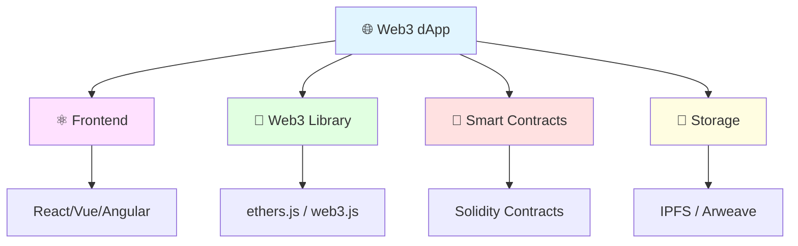

# Web3 Development 🌐

Welcome to Web3 Development! Learn how to build decentralized applications (dApps) that interact with blockchain networks. This section covers everything from connecting wallets to building full-stack dApps.



## 📚 Contents

1. **[Web3 Fundamentals](web3-fundamentals.md)** 🎯
   - What is Web3?
   - dApp architecture
   - Web3 vs Web2
   - The Web3 stack

2. **[Connecting to Blockchain](connecting-to-blockchain.md)** 🔗
   - Web3 providers
   - RPC endpoints
   - Network configuration
   - Reading blockchain data

3. **[Ethers.js vs Web3.js](ethers-vs-web3js.md)** ⚖️
   - Library comparison
   - When to use each
   - Code examples
   - Migration guide

4. **[Wallet Integration](wallet-integration.md)** 🦊
   - MetaMask connection
   - WalletConnect
   - Wallet state management
   - Handling transactions

## 🚀 Quick Start

Create your first dApp:

```bash
# Create React app
npx create-react-app my-dapp
cd my-dapp

# Install dependencies
npm install ethers wagmi viem

# Start development
npm start
```

## 🛠️ Essential Tools

- **ethers.js** - Modern Web3 library
- **wagmi** - React hooks for Ethereum
- **RainbowKit** - Wallet connection UI
- **The Graph** - Query blockchain data
- **IPFS** - Decentralized storage

## 🎯 Learning Path

1. ✅ Understand Web3 fundamentals
2. ✅ Connect to blockchain networks
3. ✅ Integrate wallet connections
4. ✅ Read smart contract data
5. ✅ Send transactions
6. ✅ Handle events and logs
7. ✅ Build full-stack dApps

---

**Start Learning**: [Web3 Fundamentals](web3-fundamentals.md) →
