# Web3 Fundamentals 🌐

## Introduction

Welcome to Web3 - the next evolution of the internet! 🚀 Web3 represents a paradigm shift from centralized platforms to decentralized applications powered by blockchain technology.

```mermaid
graph LR
    A[Web 1.0<br/>📄 Read Only] --> B[Web 2.0<br/>📝 Read-Write]
    B --> C[Web 3.0<br/>🔗 Read-Write-Own]
    
    A1[Static Pages] --> A
    A2[No Interaction] --> A
    
    B1[Social Media] --> B
    B2[User Content] --> B
    B3[Centralized] --> B
    
    C1[Decentralized] --> C
    C2[User Ownership] --> C
    C3[Blockchain] --> C
    
    style A fill:#e1e1e1
    style B fill:#ffe1ff
    style C fill:#e1ffe1
```



## What is Web3? 🤔

**Web3** is the decentralized internet built on blockchain technology where users own their data, identity, and digital assets.

### Evolution of the Web

| Era | Description | Example | Control |
|-----|-------------|---------|---------|
| **Web 1.0** 📄 | Read-only static websites | Yahoo directory | Webmasters |
| **Web 2.0** 📝 | Interactive, user-generated content | Facebook, YouTube | Platforms |
| **Web 3.0** 🔗 | Decentralized, user-owned | Uniswap, ENS | Users |


## Core Principles of Web3 🎯

### 1. Decentralization 🌐

No single entity controls the network or data.


### 2. Ownership 🏆

Users own their:
- **Digital assets** (tokens, NFTs)
- **Data** (stored on-chain or IPFS)
- **Identity** (wallet addresses, ENS names)
- **Content** (verified ownership)

### 3. Trustless 🤝

Interact without needing to trust intermediaries:
- Smart contracts enforce rules
- Blockchain provides transparency
- Cryptography ensures security

### 4. Permissionless 🚪

Anyone can:
- Participate without approval
- Build applications freely
- Access services globally
- Create value without gatekeepers

## Web3 Architecture 🏗️

```mermaid
graph TD
    A[👤 User] --> B[🦊 Wallet]
    B --> C[⚛️ Frontend dApp]
    C --> D[📚 Web3 Library]
    D --> E[🌐 RPC Provider]
    E --> F[⛓️ Blockchain]
    
    F --> G[📜 Smart Contracts]
    F --> H[💾 On-chain Data]
    
    I[📦 IPFS] --> C
    J[🔍 The Graph] --> C
    
    style A fill:#e1f5ff
    style B fill:#ffe1ff
    style C fill:#e1ffe1
    style F fill:#fffde1
```



### Frontend Layer (Client)

**Technologies:**
- React, Vue, Angular
- Next.js, Vite
- HTML, CSS, JavaScript

**Purpose:**
- User interface
- Wallet connection
- Transaction signing
- Display blockchain data

### Web3 Library Layer

**Popular Libraries:**
- **ethers.js** 🔷 (Modern, lightweight)
- **web3.js** 🟢 (Original, feature-rich)
- **wagmi** ⚡ (React hooks)
- **viem** 🚀 (TypeScript-first)

**Purpose:**
- Connect to blockchain
- Read contract data
- Send transactions
- Listen to events

### Provider Layer

**RPC Providers:**
- **Infura** - Managed infrastructure
- **Alchemy** - Enhanced APIs
- **QuickNode** - Fast endpoints
- **Your own node** - Full control

**Purpose:**
- Communicate with blockchain
- Submit transactions
- Query blockchain state
- Access historical data

### Blockchain Layer

**Components:**
- Smart contracts
- On-chain data
- Consensus mechanism
- Network participants

## Web3 vs Web2 Comparison 📊


| Aspect | Web2 | Web3 |
|--------|------|------|
| **Data Storage** | Company servers | Decentralized (IPFS, blockchain) |
| **Identity** | Email/password | Wallet address |
| **Login** | Username + password | Sign with wallet |
| **Ownership** | Platform owns | User owns |
| **Monetization** | Platform profits | User profits |
| **Censorship** | Possible | Resistant |
| **Privacy** | Limited | Enhanced |
| **Downtime** | Possible | Minimal |

## The Web3 Stack 🥞


### 1. Frontend Technologies 🎨

- **React/Next.js** - Most popular
- **Vue/Nuxt** - Developer-friendly
- **Angular** - Enterprise
- **Svelte** - Lightweight

### 2. Web3 Libraries 📚

- **ethers.js** - Clean API, TypeScript
- **web3.js** - Original library
- **wagmi** - React hooks
- **Web3Modal** - Wallet connection UI

### 3. Blockchain Networks ⛓️

- **Ethereum** - Most dApps
- **Polygon** - Fast & cheap
- **Arbitrum/Optimism** - L2 scaling
- **Solana** - High throughput
- **Avalanche** - Sub-second finality

### 4. Storage Solutions 💾

- **IPFS** - Distributed file storage
- **Arweave** - Permanent storage
- **Filecoin** - Incentivized storage
- **Ceramic** - Decentralized database

### 5. Indexing & Querying 🔍

- **The Graph** - Query protocol
- **Moralis** - Web3 APIs
- **Covalent** - Blockchain data
- **Dune Analytics** - Analytics

### 6. Infrastructure 🏗️

- **Infura** - Node service
- **Alchemy** - Development platform
- **Chainlink** - Oracles
- **Tenderly** - Monitoring

## Key Web3 Concepts 🔑

### Wallets 👛

```mermaid
graph TD
    A[Wallet] --> B[Custodial]
    A --> C[Non-Custodial]
    
    B --> B1[Exchange Wallet<br/>Coinbase, Binance]
    B --> B2[❌ They control keys]
    
    C --> C1[Software Wallet<br/>MetaMask, Trust]
    C --> C2[Hardware Wallet<br/>Ledger, Trezor]
    C --> C3[✅ You control keys]
    
    style A fill:#e1f5ff
    style B fill:#ffe1e1
    style C fill:#e1ffe1
```



**Not your keys, not your coins!** 🔑

### Gas Fees ⛽

Transaction costs for using the blockchain:
- **Base fee** - Network minimum
- **Priority fee** - Speed up transaction
- **Total cost** = Gas used × Gas price

### Transactions 💸

Signed messages that change blockchain state:
- Transfer tokens
- Interact with contracts
- Deploy new contracts
- Update data

## Common Web3 Patterns 🎨

### 1. Connect Wallet

```javascript
// Using ethers.js
async function connectWallet() {
    if (window.ethereum) {
        const provider = new ethers.BrowserProvider(window.ethereum);
        await provider.send("eth_requestAccounts", []);
        const signer = await provider.getSigner();
        return signer;
    }
}
```

### 2. Read Contract Data

```javascript
const contract = new ethers.Contract(address, abi, provider);
const balance = await contract.balanceOf(userAddress);
```

### 3. Send Transaction

```javascript
const contract = new ethers.Contract(address, abi, signer);
const tx = await contract.transfer(to, amount);
await tx.wait();
```

### 4. Listen to Events

```javascript
contract.on("Transfer", (from, to, amount) => {
    console.log(`${from} sent ${amount} to ${to}`);
});
```

## Benefits of Web3 ✨

```mermaid
mindmap
  root((Web3 Benefits))
    💰 Economic
      Own Your Data
      Monetize Content
      No Platform Fees
    🔒 Security
      Cryptographic
      Transparent
      Immutable
    🌐 Accessibility
      Global Access
      No Gatekeepers
      Censorship Resistant
    👥 Community
      User Governance
      Direct Connection
      Shared Ownership
```



## Challenges & Solutions ⚠️

| Challenge | Solution |
|-----------|----------|
| **High gas fees** | Layer 2 solutions (Polygon, Arbitrum) |
| **Slow transactions** | Sidechains, L2s |
| **Poor UX** | Account abstraction, social recovery |
| **Scalability** | Sharding, rollups |
| **Complexity** | Better dev tools, documentation |

## Web3 Use Cases 🎯

### 1. DeFi (Decentralized Finance) 💰
- Lending & borrowing (Aave, Compound)
- Decentralized exchanges (Uniswap, SushiSwap)
- Yield farming
- Stablecoins

### 2. NFTs (Non-Fungible Tokens) 🎨
- Digital art
- Gaming assets
- Virtual real estate
- Collectibles

### 3. DAOs (Decentralized Organizations) 🏛️
- Governance tokens
- Collective decision-making
- Treasury management

### 4. Social Media 📱
- Lens Protocol
- Farcaster
- Mirror
- User-owned content

### 5. Gaming 🎮
- Play-to-earn
- True asset ownership
- Interoperable items
- Player-driven economies

## Getting Started Checklist ✅

- [ ] Install MetaMask wallet
- [ ] Get test ETH from faucet
- [ ] Try a dApp (Uniswap, OpenSea)
- [ ] Connect wallet to website
- [ ] Sign a transaction
- [ ] Interact with smart contract
- [ ] Build your first dApp

## Next Steps 🚀

Ready to build on Web3?

➡️ [Connecting to Blockchain](connecting-to-blockchain.md) - Learn RPC providers  
➡️ [Wallet Integration](wallet-integration.md) - MetaMask & WalletConnect  
➡️ [Ethers.js Guide](ethers-vs-web3js.md) - Choose your library

## Resources 📚

### Documentation
- [Ethereum.org](https://ethereum.org/developers)
- [Web3.js Docs](https://web3js.readthedocs.io/)
- [Ethers.js Docs](https://docs.ethers.org/)

### Tutorials
- [LearnWeb3](https://learnweb3.io/)
- [Buildspace](https://buildspace.so/)
- [Alchemy University](https://university.alchemy.com/)

### Tools
- [Remix IDE](https://remix.ethereum.org/)
- [Hardhat](https://hardhat.org/)
- [Scaffold-ETH](https://scaffoldeth.io/)

---

**🎯 Learning Objective Achieved**: You now understand Web3 fundamentals and are ready to build decentralized applications!

**⏰ Estimated Reading Time**: 30-35 minutes  
**🎖️ Badge Progress**: Web3 Builder (25% Complete)
