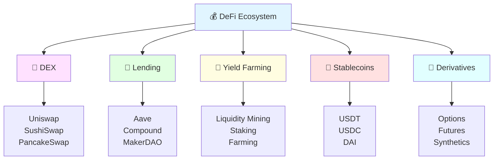

# Decentralized Finance (DeFi) 💰

Welcome to the DeFi section! Learn about the revolutionary financial applications being built on blockchain technology. DeFi eliminates traditional intermediaries and makes finance accessible to everyone.

## 📚 Contents

1. **[DeFi Overview](defi-overview.md)** 🎯
   - What is DeFi?
   - Key principles
   - DeFi vs Traditional Finance
   - Major protocols

2. **[DEX & AMM Mechanics](uniswap-mechanics.md)** 🔄
   - Automated Market Makers
   - Liquidity pools
   - Impermanent loss
   - Slippage and fees

3. **[Lending Protocols](lending-protocols.md)** 🏦
   - Supplying assets
   - Borrowing mechanisms
   - Collateralization
   - Liquidations

4. **[Yield Farming](yield-farming.md)** 🌾
   - Liquidity mining
   - Staking strategies
   - Risk management
   - APY calculations

## 💡 Key Concepts

### Total Value Locked (TVL) 📊
The total amount of assets locked in DeFi protocols

### Annual Percentage Yield (APY) 📈
The real rate of return earned on an investment with compound interest

### Impermanent Loss ⚠️
The difference between holding tokens vs. providing liquidity

### Smart Contract Risk 🔒
Risks associated with bugs or exploits in DeFi protocols

## 🌟 Major DeFi Protocols

| Protocol | Type | TVL | Description |
|----------|------|-----|-------------|
| **Uniswap** | DEX | $3B+ | Leading AMM protocol |
| **Aave** | Lending | $5B+ | Decentralized lending platform |
| **Curve** | DEX | $2B+ | Stablecoin-focused AMM |
| **MakerDAO** | Lending | $4B+ | DAI stablecoin issuer |
| **Compound** | Lending | $2B+ | Algorithmic money market |

## 🎯 Learning Path

1. ✅ Understand DeFi fundamentals
2. ✅ Learn how DEXs work
3. ✅ Explore lending protocols
4. ✅ Practice yield farming
5. ✅ Manage risks
6. ✅ Build DeFi dApps

## ⚠️ DeFi Risks

- 🐛 Smart contract bugs
- 💸 Impermanent loss
- 📉 Market volatility
- 🔓 Custody risks
- ⛓️ Oracle failures
- 🏃 Rug pulls

## 🛠️ DeFi Development Tools

- **Hardhat** - Smart contract development
- **Uniswap SDK** - DEX integration
- **Chainlink** - Price oracles
- **The Graph** - Data indexing
- **OpenZeppelin** - Secure contracts

---

**Start Learning**: [DeFi Overview](defi-overview.md) →
