# DeFi Overview 💰

> **⚠️ IMPORTANT DISCLAIMER**: This content is for educational purposes only. DeFi involves significant financial risks including total loss of funds. Always do your own research, never invest more than you can afford to lose, and consider consulting with financial professionals. Not financial advice.

## Introduction

Welcome to **Decentralized Finance (DeFi)** - the revolutionary movement to rebuild traditional financial services without banks or intermediaries! 🚀


## What is DeFi? 🤔

**DeFi** is an ecosystem of financial applications built on blockchain networks (primarily Ethereum) that operate without traditional intermediaries like banks, brokers, or exchanges.

### Core Principles

```mermaid
mindmap
  root((💰 DeFi))
    🔓 Permissionless
      No KYC
      Global Access
      No Discrimination
    🔍 Transparent
      Open Source
      On-chain Data
      Auditable
    🤝 Trustless
      Smart Contracts
      No Middlemen
      Automated
    🧩 Composable
      Lego Blocks
      Interoperable
      Innovation
```



## DeFi vs Traditional Finance 📊

| Aspect | Traditional Finance | DeFi |
|--------|-------------------|------|
| **Access** | KYC required | Wallet only |
| **Hours** | 9-5, weekdays | 24/7/365 |
| **Speed** | Days | Minutes |
| **Fees** | High | Low-Medium |
| **Custody** | Bank holds funds | You control |
| **Geography** | Country-specific | Global |
| **Transparency** | Opaque | Fully transparent |
| **Censorship** | Possible | Resistant |

## The DeFi Ecosystem 🌍

```mermaid
graph TD
    A[💰 DeFi Ecosystem] --> B[🔄 DEXs]
    A --> C[🏦 Lending]
    A --> D[💱 Stablecoins]
    A --> E[🌾 Yield Farming]
    A --> F[🎯 Derivatives]
    A --> G[🔮 Oracles]
    A --> H[🛡️ Insurance]
    
    B --> B1[Uniswap<br/>SushiSwap<br/>Curve]
    C --> C1[Aave<br/>Compound<br/>MakerDAO]
    D --> D1[USDT<br/>USDC<br/>DAI]
    E --> E1[Liquidity Mining<br/>Staking<br/>Strategies]
    F --> F1[Synthetix<br/>dYdX<br/>Perpetual]
    G --> G1[Chainlink<br/>Band Protocol<br/>UMA]
    H --> H1[Nexus Mutual<br/>Cover Protocol]
    
    style A fill:#e1f5ff
```



## Key DeFi Components 🔑

### 1. Decentralized Exchanges (DEXs) 🔄

Trade tokens without intermediaries using **Automated Market Makers (AMMs)**.

```mermaid
graph LR
    A[👤 User] --> B[🔄 DEX Smart Contract]
    B --> C[🏊 Liquidity Pool]
    C --> D[Token A<br/>Token B]
    
    E[💧 Liquidity Provider] --> C
    C --> F[💰 Trading Fees]
    F --> E
    
    style B fill:#e1f5ff
    style C fill:#ffe1ff
```



**Popular DEXs:**
- **Uniswap** - Largest by volume
- **SushiSwap** - Community-driven
- **Curve** - Stablecoin specialist
- **PancakeSwap** - BSC leader
- **Balancer** - Flexible pools

**How it works:**
1. Liquidity providers deposit token pairs
2. Users trade against the pool
3. Prices determined by pool ratios
4. Fees distributed to LPs

### 2. Lending & Borrowing 🏦

Earn interest on deposits or borrow against collateral.

```mermaid
sequenceDiagram
    participant Lender
    participant Protocol
    participant Borrower
    
    Lender->>Protocol: Deposit USDC 💵
    Protocol->>Lender: Receive aUSDC 🎫
    Note over Protocol: Interest accrues
    
    Borrower->>Protocol: Deposit ETH (collateral) 💎
    Protocol->>Borrower: Borrow USDC 💵
    Note over Borrower: Pay interest
    
    Borrower->>Protocol: Repay USDC + interest
    Protocol->>Borrower: Return ETH
    
    Lender->>Protocol: Redeem aUSDC
    Protocol->>Lender: Return USDC + interest 💰
```



**Major Protocols:**
- **Aave** - Leading lending protocol
- **Compound** - Algorithmic money market
- **MakerDAO** - DAI stablecoin issuer

**Key Concepts:**
- **Supply APY** - Interest for lenders
- **Borrow APY** - Interest for borrowers
- **Collateralization Ratio** - Minimum collateral
- **Liquidation** - Forced sale if under-collateralized

### 3. Stablecoins 💱

Cryptocurrencies pegged to stable assets (usually USD).

```mermaid
graph TD
    A[💱 Stablecoins] --> B[🏦 Fiat-Backed]
    A --> C[🔒 Crypto-Backed]
    A --> D[🤖 Algorithmic]
    
    B --> B1[USDT Tether<br/>USDC<br/>BUSD]
    C --> C1[DAI<br/>sUSD]
    D --> D1[FRAX<br/>UST history]
    
    style A fill:#e1f5ff
    style B fill:#e1ffe1
    style C fill:#ffe1ff
    style D fill:#fffde1
```



| Type | Example | Backed By | Trust |
|------|---------|-----------|-------|
| **Fiat-Backed** | USDC | USD reserves | Centralized |
| **Crypto-Backed** | DAI | ETH collateral | Decentralized |
| **Algorithmic** | FRAX | Algorithm | Code |

### 4. Yield Farming 🌾

Earn rewards by providing liquidity to DeFi protocols.

```mermaid
graph LR
    A[💰 Your Tokens] --> B[🏊 Liquidity Pool]
    B --> C[LP Tokens]
    C --> D[Stake LP Tokens]
    D --> E[🎁 Rewards]
    
    E --> E1[Trading Fees]
    E --> E2[Token Rewards]
    E --> E3[Bonus APY]
    
    style A fill:#e1f5ff
    style E fill:#e1ffe1
```



**Strategies:**
1. **Simple LP** - Provide liquidity, earn fees
2. **Yield Farming** - Stake LP tokens for extra rewards
3. **Leveraged Farming** - Borrow to farm more
4. **Auto-compounding** - Reinvest rewards automatically

### 5. Derivatives & Synthetics 🎯

Trade synthetic assets and leverage positions.

**Types:**
- **Options** - Right to buy/sell at price
- **Futures** - Agreement to trade at future date
- **Perpetuals** - Futures without expiry
- **Synthetic Assets** - Track real-world prices

## DeFi Metrics 📈

### Total Value Locked (TVL) 💎

Total amount of assets locked in DeFi protocols.


### Annual Percentage Yield (APY) 📊

The real rate of return with compound interest.

**Formula:**
```
APY = (1 + r/n)^n - 1

r = Interest rate
n = Compounding periods
```

**Example:**
- 10% APR compounded daily
- APY = (1 + 0.10/365)^365 - 1
- APY ≈ 10.52%

## Major DeFi Protocols 🏆

### Uniswap 🦄

**Type:** DEX (Automated Market Maker)  
**TVL:** $3B+  
**Chain:** Ethereum, Polygon, Arbitrum, Optimism

**Features:**
- V3 concentrated liquidity
- Multiple fee tiers
- LP NFTs

### Aave 👻

**Type:** Lending Protocol  
**TVL:** $5B+  
**Chain:** Ethereum, Polygon, Avalanche

**Features:**
- Flash loans
- Rate switching
- Credit delegation
- Portal (cross-chain)

### Curve Finance 🌐

**Type:** Stablecoin DEX  
**TVL:** $2B+  
**Chain:** Multiple

**Features:**
- Low slippage for stables
- Bonding curves optimized
- veCRV voting
- Convex boost

### MakerDAO 🏛️

**Type:** DAI Stablecoin  
**TVL:** $4B+  
**Chain:** Ethereum

**Features:**
- Over-collateralized stablecoin
- Decentralized governance
- Multiple collateral types
- Stability fees

## DeFi Risks ⚠️

```mermaid
graph TD
    A[⚠️ DeFi Risks] --> B[🐛 Smart Contract]
    A --> C[💸 Impermanent Loss]
    A --> D[🏃 Rug Pulls]
    A --> E[🌊 Liquidations]
    A --> F[⛓️ Oracle Failure]
    A --> G[📉 Market Risk]
    
    B --> B1[Code bugs<br/>Exploits<br/>Hacks]
    C --> C1[Price divergence<br/>Loss vs holding]
    D --> D1[Scam projects<br/>Exit scams]
    E --> E1[Forced selling<br/>Cascading effect]
    F --> F1[Price manipulation<br/>Stale data]
    G --> G1[Volatility<br/>Black swan]
    
    style A fill:#ffe1e1
```



### 1. Smart Contract Risk 🐛

**Issue:** Bugs or vulnerabilities in code  
**Mitigation:**
- ✅ Use audited protocols
- ✅ Check security reports
- ✅ Diversify across protocols
- ✅ Don't invest more than you can lose

### 2. Impermanent Loss 💸

**Issue:** Loss compared to just holding tokens


**Formula:**
```
IL = 2 * sqrt(price_ratio) / (1 + price_ratio) - 1
```

**Example:**
- ETH/USDC pool at $2000
- ETH rises to $4000 (2x)
- Impermanent Loss: ~5.7%

**Mitigation:**
- Use stablecoin pairs
- Farm high APY to offset
- Understand the risk

### 3. Liquidation Risk 🌊

**Issue:** Collateral sold if price drops

**Example:**
1. Deposit $10,000 ETH as collateral
2. Borrow $6,000 USDC (150% ratio)
3. ETH price drops 40%
4. Collateral now worth $6,000
5. Liquidated! Lost everything

**Mitigation:**
- High collateral ratio (200%+)
- Monitor positions
- Set up alerts
- Use stop-losses

### 4. Rug Pulls 🏃

**Issue:** Developers exit scam

**Red Flags:**
- Anonymous team
- No audit
- Insane APYs (1000%+)
- Locked liquidity < 1 year
- Poor documentation

**Mitigation:**
- Research team
- Check audits
- Verify contracts
- Use established protocols

## DeFi Strategies 📋

### Conservative 🛡️

**Risk:** Low  
**Return:** 5-15% APY

1. Lend stablecoins (USDC, DAI)
2. Provide liquidity to stable pairs
3. Use blue-chip protocols (Aave, Compound)

### Moderate 🎯

**Risk:** Medium  
**Return:** 15-50% APY

1. ETH/stablecoin LPs
2. Yield farming on established DEXs
3. Single-sided staking

### Aggressive 🚀

**Risk:** High  
**Return:** 50%+ APY

1. New protocol farming
2. Leveraged positions
3. Exotic pairs
4. High-risk farms

## Getting Started with DeFi 🚀

### Step 1: Setup Wallet 👛


### Step 2: Get Test Funds 💰

1. Use testnet faucets (Goerli, Sepolia)
2. Practice on testnets first
3. Learn without risk

### Step 3: Try Simple DeFi 🎯

**Recommended First Steps:**
1. Swap on Uniswap
2. Provide liquidity (small amount)
3. Lend on Aave
4. Mint DAI

### Step 4: Learn & Earn 📚

- Complete quests on Layer3
- Follow DeFi influencers
- Join Discord communities
- Read protocol docs

## DeFi Tools 🛠️

### Portfolio Trackers 📊
- **DeBank** - Multi-chain portfolio
- **Zapper** - DeFi dashboard
- **Zerion** - Beautiful UI
- **Rotki** - Privacy-focused

### Analytics 📈
- **DeFi Llama** - TVL rankings
- **Dune Analytics** - Custom queries
- **Token Terminal** - Metrics
- **DeFi Pulse** - Index

### Security 🔒
- **De.Fi** - Security scanner
- **Rug Doctor** - Rug check
- **Token Sniffer** - Token analysis
- **CertiK** - Audit database

## Best Practices ✅

### Do's ✅

1. **Start Small** - Learn with small amounts
2. **Research** - Understand protocols
3. **Diversify** - Don't put all eggs in one basket
4. **Use Hardware Wallet** - For large amounts
5. **Take Profits** - Don't be greedy
6. **Monitor Positions** - Check regularly
7. **Understand Risks** - Know what can go wrong

### Don'ts ❌

1. **Don't FOMO** - Avoid emotional decisions
2. **Don't Trust Blindly** - Verify everything
3. **Don't Share Keys** - Never share seed phrase
4. **Don't Leverage Everything** - Use conservatively
5. **Don't Ignore Gas** - Factor in transaction costs
6. **Don't Skip Research** - Read documentation

## The Future of DeFi 🔮


**Trends to Watch:**
- **Real World Assets (RWA)** - Tokenized bonds, real estate
- **Cross-chain DeFi** - Seamless multi-chain
- **Institutional DeFi** - Compliance-friendly
- **Account Abstraction** - Better UX
- **Decentralized Identity** - On-chain reputation

## Next Steps 🎯

Ready to dive deeper into DeFi?

➡️ [DEX Mechanics](uniswap-mechanics.md) - How AMMs work  
➡️ [Lending Protocols](lending-protocols.md) - Earn & borrow  
➡️ [Yield Farming](yield-farming.md) - Maximize returns

## Resources 📚

### Learning
- [DeFi Dad YouTube](https://www.youtube.com/@DeFiDad)
- [Finematics](https://www.youtube.com/@Finematics)
- [Bankless](https://www.bankless.com/)

### Protocols
- [Uniswap Docs](https://docs.uniswap.org/)
- [Aave Docs](https://docs.aave.com/)
- [Curve Docs](https://docs.curve.fi/)

### Communities
- DeFi Discord servers
- Twitter DeFi community
- Reddit r/DeFi

---

**🎯 Learning Objective Achieved**: You now understand DeFi fundamentals and are ready to participate in decentralized finance!

**⏰ Estimated Reading Time**: 40-45 minutes  
**🎖️ Badge Progress**: DeFi Developer (33% Complete)

**⚠️ Disclaimer**: This is educational content only. DeFi involves significant risks. Always do your own research and never invest more than you can afford to lose.
