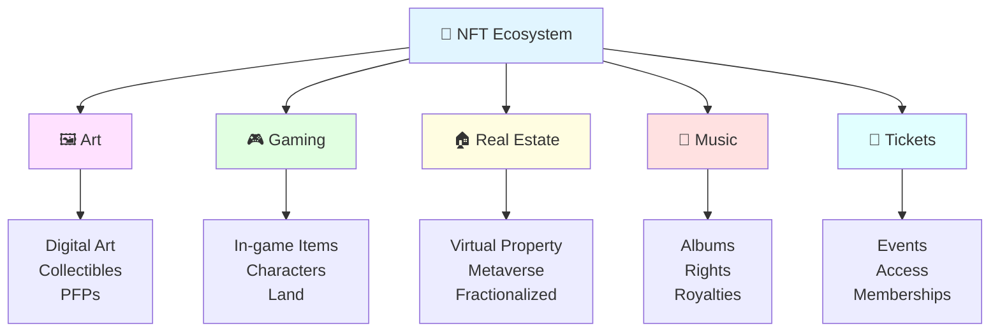
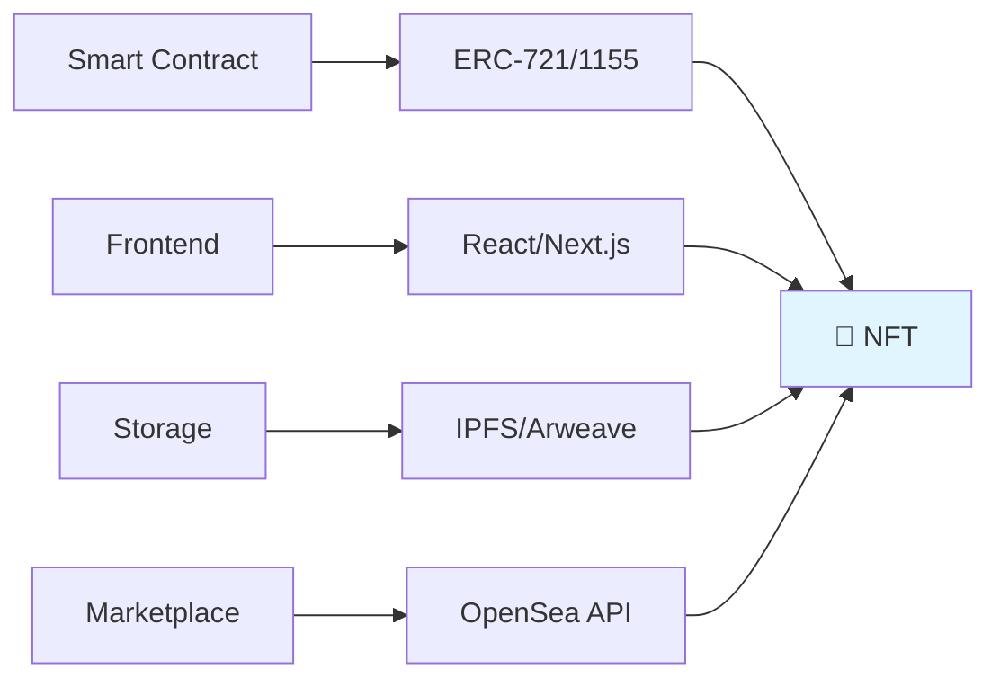

# Non-Fungible Tokens (NFTs) 🎨

Welcome to the NFT section! Learn about digital ownership, unique tokens, and how to create and trade NFTs on the blockchain.



## 📚 Contents

1. **[NFT Basics](nft-basics.md)** 🎯
   - What are NFTs?
   - Fungible vs Non-fungible
   - Use cases
   - NFT standards

2. **[ERC-721 Standard](erc721-standard.md)** 📜
   - Token standard specification
   - Implementation guide
   - Minting NFTs
   - Transfer mechanisms

3. **[ERC-1155 Multi-Token](erc1155-standard.md)** 🎭
   - Batch operations
   - Semi-fungible tokens
   - Gas efficiency
   - Gaming applications

4. **[Metadata & IPFS](metadata-standards.md)** 📦
   - Metadata structure
   - IPFS storage
   - Image hosting
   - Attributes & traits

5. **[NFT Marketplaces](nft-marketplaces.md)** 🏪
   - OpenSea integration
   - Rarible protocol
   - Building custom marketplace
   - Royalties & fees

## 🌟 Popular NFT Projects

| Project | Type | Description |
|---------|------|-------------|
| **CryptoPunks** | PFP | Original NFT collection |
| **Bored Ape Yacht Club** | PFP | Community-driven project |
| **Azuki** | PFP | Anime-inspired NFTs |
| **Art Blocks** | Generative | Algorithmic art |
| **Decentraland** | Metaverse | Virtual real estate |

## 🛠️ NFT Development Stack



### Essential Tools

- **Solidity** - Smart contract language
- **OpenZeppelin** - NFT contract templates
- **IPFS** - Decentralized storage
- **Pinata** - IPFS pinning service
- **NFT.storage** - Free IPFS storage
- **OpenSea** - Largest NFT marketplace
- **Ethers.js** - Blockchain interaction

## 🎯 Learning Path

1. ✅ Understand NFT fundamentals
2. ✅ Learn ERC-721 standard
3. ✅ Explore ERC-1155
4. ✅ Store metadata on IPFS
5. ✅ Build minting dApp
6. ✅ Integrate with marketplaces
7. ✅ Launch NFT collection

## 📊 NFT Standards Comparison

| Feature | ERC-721 | ERC-1155 |
|---------|---------|----------|
| **Token Type** | One per contract | Multiple types |
| **Gas Cost** | Higher | Lower (batch) |
| **Use Case** | Unique items | Gaming, tickets |
| **Complexity** | Simple | Advanced |
| **Transfers** | One at a time | Batch possible |

## 🎨 Creating NFT Art

### Generative Art Tools
- **p5.js** - Creative coding
- **Processing** - Visual art programming
- **Three.js** - 3D graphics

### Design Tools
- **Adobe Illustrator** - Vector graphics
- **Photoshop** - Digital art
- **Blender** - 3D modeling
- **Figma** - UI/UX design

## 💰 NFT Economics

### Minting Costs
- Gas fees (variable)
- Platform fees
- Storage costs

### Revenue Streams
- Primary sales
- Royalties (2.5-10%)
- Licensing
- Utility/Access

### Rarity & Pricing
```
Value = Rarity × Demand × Utility + Community
```

## 🚀 Launch Checklist

- [ ] Design collection artwork
- [ ] Write smart contract
- [ ] Audit contract code
- [ ] Upload metadata to IPFS
- [ ] Deploy to testnet
- [ ] Test minting process
- [ ] Deploy to mainnet
- [ ] Verify contract on Etherscan
- [ ] List on marketplaces
- [ ] Build community
- [ ] Market your collection

## ⚠️ Common Pitfalls

1. ❌ Not pinning IPFS files
2. ❌ Hardcoding metadata URIs
3. ❌ Missing royalty implementation
4. ❌ Poor random distribution
5. ❌ Ignoring gas costs
6. ❌ Weak community building
7. ❌ Inadequate testing
8. ❌ Security vulnerabilities

## 🎓 Hands-On Projects

### Beginner 🌱
1. **Simple NFT** - Basic ERC-721 contract
2. **Profile Pictures** - Generate avatars
3. **Certificate System** - Achievement NFTs

### Intermediate 🚀
4. **Generative Art** - Algorithmic collection
5. **Music NFTs** - Audio with royalties
6. **Dynamic NFTs** - Evolving metadata

### Advanced 🏆
7. **NFT Marketplace** - Full trading platform
8. **Fractionalized NFTs** - Shared ownership
9. **NFT Lending** - Collateralized loans

## 🌐 NFT Marketplaces

| Marketplace | Blockchain | Fees |
|-------------|-----------|------|
| **OpenSea** | Ethereum, Polygon | 2.5% |
| **Rarible** | Multi-chain | 1-2.5% |
| **LooksRare** | Ethereum | 2% |
| **Magic Eden** | Solana | 2% |
| **Blur** | Ethereum | 0.5% |

## 📚 Resources

### Documentation
- [EIP-721](https://eips.ethereum.org/EIPS/eip-721)
- [EIP-1155](https://eips.ethereum.org/EIPS/eip-1155)
- [OpenSea Docs](https://docs.opensea.io/)
- [NFT School](https://nftschool.dev/)

### Communities
- NFT Discord servers
- Twitter NFT community
- Reddit r/NFT
- OpenSea community

### Tools
- [NFT Creator](https://nftcreator.com/)
- [Rarity Tools](https://rarity.tools/)
- [Trait Sniper](https://traitsniper.com/)

---

**Start Learning**: [NFT Basics](nft-basics.md) →

**🎯 Goal**: Launch your own NFT collection!
