# NFT Basics 🎨

## Introduction

Welcome to the world of **Non-Fungible Tokens (NFTs)**! 🖼️ NFTs are unique digital assets that represent ownership of one-of-a-kind items on the blockchain. Think of them as digital certificates of authenticity for anything from art to music to virtual real estate!

```mermaid
graph LR
    A[🪙 Fungible] --> B[Interchangeable<br/>1 ETH = 1 ETH]
    C[🎨 Non-Fungible] --> D[Unique<br/>NFT #1 ≠ NFT #2]
    
    B --> B1[Money<br/>Tokens<br/>Commodities]
    D --> D1[Art<br/>Collectibles<br/>Identity]
    
    style A fill:#ffe1ff
    style C fill:#e1ffe1
```



## What are NFTs? 🤔

**NFT (Non-Fungible Token)** is a unique digital asset stored on a blockchain that represents ownership of a specific item or piece of content.

### Fungible vs Non-Fungible

```mermaid
graph TD
    A[Token Comparison] --> B[🪙 Fungible Tokens]
    A --> C[🎨 Non-Fungible Tokens]
    
    B --> B1[✅ Identical]
    B --> B2[✅ Divisible]
    B --> B3[✅ Interchangeable]
    B4[Examples:<br/>ETH, USDC, BTC] --> B
    
    C --> C1[✅ Unique]
    C --> C2[❌ Indivisible]
    C --> C3[❌ Not Interchangeable]
    C4[Examples:<br/>Art, Collectibles, Tickets] --> C
    
    style B fill:#ffe1ff
    style C fill:#e1ffe1
```



| Aspect | Fungible (ERC-20) | Non-Fungible (ERC-721) |
|--------|------------------|------------------------|
| **Uniqueness** | All identical | Each unique |
| **Divisibility** | Divisible (0.5 ETH) | Whole units only |
| **Interchangeable** | Yes (1 ETH = 1 ETH) | No (each different) |
| **Examples** | Money, tokens | Art, tickets, IDs |
| **Metadata** | Same for all | Unique per token |

## NFT Components 🧩

```mermaid
graph TD
    A[🎨 NFT] --> B[📜 Smart Contract]
    A --> C[💾 Metadata]
    A --> D[🖼️ Media File]
    A --> E[🔗 Token ID]
    
    B --> B1[Mint Function<br/>Transfer Logic<br/>Ownership Track]
    C --> C1[Name<br/>Description<br/>Attributes<br/>Image URI]
    D --> D1[Stored on IPFS<br/>or Arweave<br/>or Cloud]
    E --> E1[Unique Identifier<br/>1, 2, 3, 4...]
    
    style A fill:#e1f5ff
```



### 1. Smart Contract 📜

The code that creates and manages the NFT.

```solidity
// Simple NFT Contract
contract MyNFT is ERC721 {
    uint256 public tokenCounter;
    
    constructor() ERC721("My NFT", "MNFT") {
        tokenCounter = 0;
    }
    
    function mint() public {
        _safeMint(msg.sender, tokenCounter);
        tokenCounter++;
    }
}
```

### 2. Token ID 🔢

Unique identifier for each NFT.

- Token #0, Token #1, Token #2...
- Used to track ownership
- Cannot be duplicated

### 3. Metadata 📋

Information about the NFT stored as JSON.

```json
{
  "name": "Cool Dragon #123",
  "description": "A legendary dragon from the blockchain",
  "image": "ipfs://QmX...abc",
  "attributes": [
    {
      "trait_type": "Rarity",
      "value": "Legendary"
    },
    {
      "trait_type": "Power",
      "value": 95
    }
  ]
}
```

### 4. Media File 🖼️

The actual image, video, or audio.

```mermaid
graph LR
    A[Media Storage] --> B[☁️ Centralized]
    A --> C[🌐 Decentralized]
    
    B --> B1[AWS S3<br/>❌ Can disappear]
    C --> C1[IPFS<br/>✅ Permanent]
    C --> C2[Arweave<br/>✅ Forever]
    
    style B fill:#ffe1e1
    style C fill:#e1ffe1
```



## NFT Standards 📐


### ERC-721 (Most Common) 🎨

**Features:**
- One unique token per ID
- Standard for digital art
- Individual transfers
- Simple metadata

**Use Cases:**
- Digital art (Bored Apes, CryptoPunks)
- Virtual real estate (Decentraland)
- Domain names (ENS)
- Tickets and passes

### ERC-1155 (Multi-Token) 🎭

**Features:**
- Multiple token types in one contract
- Batch transfers
- Fungible + non-fungible
- Gas efficient

**Use Cases:**
- Gaming items
- Event tickets
- Multiple editions
- Semi-fungible tokens

### Comparison

| Feature | ERC-721 | ERC-1155 |
|---------|---------|----------|
| **Tokens** | One type | Multiple types |
| **Batch Ops** | No | Yes |
| **Gas Cost** | Higher | Lower |
| **Complexity** | Simple | Advanced |
| **Best For** | Unique art | Gaming |

## NFT Use Cases 🎯

```mermaid
mindmap
  root((🎨 NFT<br/>Use Cases))
    🖼️ Digital Art
      Collectibles
      Generative Art
      Photography
    🎮 Gaming
      Characters
      Items
      Land
      Skins
    🎵 Music
      Albums
      Rights
      Royalties
      Access
    🏠 Real Estate
      Virtual Land
      Physical Property
      Fractional Ownership
    🎫 Tickets
      Events
      Concerts
      Access Passes
    🆔 Identity
      Credentials
      Reputation
      Memberships
    💼 Business
      Patents
      Trademarks
      Contracts
```



### 1. Digital Art 🖼️

**Examples:**
- **CryptoPunks** - 10,000 unique characters
- **Bored Ape Yacht Club (BAYC)** - PFP + membership
- **Art Blocks** - Generative on-chain art

**Value Factors:**
- Artist reputation
- Rarity traits
- Historical significance
- Community

### 2. Gaming Assets 🎮

**Examples:**
- **Axie Infinity** - Play-to-earn creatures
- **Gods Unchained** - Trading cards
- **The Sandbox** - Virtual land
- **Decentraland** - Metaverse parcels

**Benefits:**
- True ownership
- Cross-game portability
- Real trading value
- Player-driven economy

### 3. Music & Entertainment 🎵

**Examples:**
- Album releases
- Concert tickets
- Exclusive content
- Royalty rights

**Benefits:**
- Direct artist-to-fan
- Ongoing royalties
- Proof of attendance
- Collectible value

### 4. Virtual Real Estate 🏠

**Examples:**
- **Decentraland** LAND
- **The Sandbox** estates
- **Otherdeed** for Otherside

**Value Factors:**
- Location in metaverse
- Development potential
- Traffic and visibility
- Neighboring properties

## How NFTs Work 🔧

```mermaid
sequenceDiagram
    participant Creator
    participant Contract
    participant IPFS
    participant Marketplace
    participant Buyer
    
    Creator->>IPFS: Upload image 🖼️
    IPFS->>Creator: Return CID
    Creator->>IPFS: Upload metadata 📋
    IPFS->>Creator: Return CID
    Creator->>Contract: Mint NFT 🎨
    Contract->>Creator: Assign Token ID #123
    
    Creator->>Marketplace: List for sale 💰
    Buyer->>Marketplace: Purchase NFT
    Marketplace->>Contract: Transfer ownership
    Contract->>Buyer: You now own #123! 🎉
```



### Minting Process 🔨

1. **Create Content** - Design your art/asset
2. **Upload to IPFS** - Permanent storage
3. **Create Metadata** - JSON with details
4. **Deploy Contract** - Or use existing
5. **Mint Token** - Call mint function
6. **Pay Gas Fees** - Transaction costs
7. **Receive NFT** - Now in your wallet!

### Trading Process 💱


## NFT Marketplaces 🏪


### Popular Marketplaces

| Marketplace | Focus | Chain | Fees |
|-------------|-------|-------|------|
| **OpenSea** | General | Multi | 2.5% |
| **Rarible** | Community | Multi | 1-2.5% |
| **SuperRare** | High-end art | Ethereum | 15% |
| **Magic Eden** | Solana NFTs | Solana | 2% |
| **Blur** | Pro trading | Ethereum | 0.5% |

## NFT Rarity & Value 💎

### Rarity Traits 🌟


**Factors:**
- **Trait Rarity** - How common each attribute
- **Trait Count** - Number of unique traits
- **Aesthetic** - Visual appeal
- **Utility** - Real-world benefits

### Value Drivers 📈

1. **Creator Reputation** ⭐
   - Established artists
   - Successful previous projects
   - Community trust

2. **Scarcity** 🔢
   - Limited supply
   - Rare traits
   - One-of-ones

3. **Utility** 🎁
   - Access to events
   - Governance rights
   - Breeding/gameplay
   - Physical items

4. **Community** 👥
   - Strong holder base
   - Active Discord
   - Celebrity owners
   - Brand partnerships

5. **Market Sentiment** 📊
   - Bull/bear market
   - Trending projects
   - Media attention

## NFT Risks & Challenges ⚠️

```mermaid
graph TD
    A[⚠️ NFT Risks] --> B[💸 Financial]
    A --> C[🐛 Technical]
    A --> D[📜 Legal]
    A --> E[🌐 Market]
    
    B --> B1[High volatility<br/>Illiquidity<br/>Scams]
    C --> C1[Smart contract bugs<br/>Metadata loss<br/>Wallet hacks]
    D --> D1[Copyright issues<br/>Regulatory uncertainty<br/>Tax implications]
    E --> E1[Market crashes<br/>Low volume<br/>Wash trading]
    
    style A fill:#ffe1e1
```



### 1. Financial Risks 💸

- **High Volatility** - Prices can crash
- **Illiquidity** - Hard to sell quickly
- **Scams** - Fake projects, rug pulls
- **Overpaying** - FOMO purchases

### 2. Technical Risks 🐛

- **Smart Contract Bugs** - Exploit vulnerabilities
- **Metadata Loss** - If hosting fails
- **Wallet Security** - Phishing, hacks
- **Gas Fees** - Expensive transactions

### 3. Legal/Regulatory 📜

- **Copyright** - Not all NFTs have IP rights
- **Securities Law** - Some NFTs may be securities
- **Taxes** - Capital gains, income tax
- **No Consumer Protection** - Irreversible transactions

### 4. Environmental Impact 🌍

- **Energy Consumption** - PoW blockchains
- **Carbon Footprint** - Minting costs
- **Solutions** - PoS chains (Ethereum 2.0)

## Creating Your First NFT 🎨

### Step-by-Step Guide


1. **Create Digital Asset** 🎨
   - Design artwork
   - Create 3D model
   - Generate collection
   - Record audio/video

2. **Choose Blockchain** ⛓️
   - **Ethereum** - Most popular, expensive
   - **Polygon** - Cheaper, fast
   - **Solana** - Very fast, low cost
   - **Tezos** - Eco-friendly

3. **Setup Wallet** 👛
   - Install MetaMask
   - Create account
   - Save seed phrase
   - Fund with ETH

4. **Connect to Marketplace** 🏪
   - Go to OpenSea/Rarible
   - Connect wallet
   - Sign message
   - Profile ready!

5. **Upload & Mint** 🔨
   - Upload file
   - Add details (name, description)
   - Set royalties (5-10%)
   - Pay gas fee
   - Mint NFT!

6. **List for Sale** 💰
   - Set fixed price or auction
   - Choose currency (ETH, WETH)
   - Duration
   - List!

## NFT Best Practices ✅

### For Creators 🎨

✅ **Do:**
- Create original content
- Use IPFS for storage
- Set reasonable royalties (5-10%)
- Build community first
- Be transparent
- Deliver utility

❌ **Don't:**
- Copy others' work
- Overpromise utility
- Rug pull your community
- Neglect your holders
- Ignore legal implications

### For Collectors 🖼️

✅ **Do:**
- Research projects thoroughly
- Check contract on Etherscan
- Verify official links
- Start small
- Join Discord/Twitter
- Understand risks

❌ **Don't:**
- FOMO into hype
- Trust random DMs
- Share seed phrase
- Ignore red flags
- Invest more than you can lose
- Skip due diligence

## The Future of NFTs 🔮


**Emerging Trends:**
- **Dynamic NFTs** - Change over time
- **Soulbound Tokens** - Non-transferable
- **NFT Fractionalization** - Shared ownership
- **Real-World Assets** - Physical items as NFTs
- **Social Tokens** - Creator economies
- **AI-Generated** - ML art creation

## Next Steps 🚀

Ready to dive deeper into NFTs?

➡️ [ERC-721 Standard](erc721-standard.md) - Token implementation  
➡️ [Metadata & IPFS](metadata-standards.md) - Proper storage  
➡️ [NFT Marketplaces](nft-marketplaces.md) - Build your own

## Resources 📚

### Learning
- [NFT School](https://nftschool.dev/)
- [OpenSea Learn](https://opensea.io/learn)
- [Nifty Gateway](https://niftygateway.com/)

### Tools
- **Rarity.tools** - Rarity rankings
- **NFTGo** - Analytics
- **Context** - Portfolio tracker
- **Icy.tools** - Market data

### Communities
- NFT Discord servers
- Twitter NFT community
- Reddit r/NFT

---

**🎯 Learning Objective Achieved**: You now understand NFT fundamentals and are ready to create or collect NFTs!

**⏰ Estimated Reading Time**: 35-40 minutes  
**🎖️ Badge Progress**: NFT Creator (33% Complete)

**⚠️ Disclaimer**: NFTs are highly speculative. Always do your own research and never invest more than you can afford to lose. Not financial advice.
