# Advanced Blockchain Topics 🚀

Welcome to advanced blockchain concepts! This section covers cutting-edge technologies and sophisticated implementations that are shaping the future of blockchain.

```mermaid
graph TD
    A[🚀 Advanced Topics] --> B[⚡ Layer 2]
    A --> C[🌉 Bridges]
    A --> D[🏛️ DAOs]
    A --> E[💎 MEV]
    A --> F[🔮 ZK Proofs]
    A --> G[🔗 Interoperability]
    
    B --> B1[Rollups<br/>State Channels<br/>Sidechains]
    C --> C1[Cross-chain<br/>Asset Transfer<br/>Security]
    D --> D1[Governance<br/>Voting<br/>Treasury]
    E --> E1[Flashloans<br/>Arbitrage<br/>Sandwich Attacks]
    F --> F1[Privacy<br/>Scalability<br/>Verification]
    G --> G1[Cosmos<br/>Polkadot<br/>IBC]
    
    style A fill:#e1f5ff
    style B fill:#ffe1ff
    style C fill:#e1ffe1
    style D fill:#fffde1
    style E fill:#ffe1e1
    style F fill:#e1ffff
    style G fill:#ffe1e1
```



## 📚 Contents

### 1. Layer 2 Scaling Solutions ⚡

**Estimated Time**: 60-70 minutes

Learn how Layer 2 solutions scale Ethereum:

- **Rollups** 📜
  - Optimistic Rollups (Arbitrum, Optimism)
  - ZK-Rollups (zkSync, StarkNet)
  - Data availability
  
- **State Channels** 📡
  - Lightning Network
  - Raiden Network
  - Payment channels
  
- **Sidechains** ⛓️
  - Polygon
  - xDai
  - Security tradeoffs


### 2. Cross-Chain Bridges 🌉

**Estimated Time**: 50-60 minutes

Connect different blockchain networks:

- Bridge architectures
- Security models
- Wrapped tokens
- Trust assumptions
- Bridge exploits & lessons

**Popular Bridges:**
- Wormhole (Multi-chain)
- Hop Protocol (L2 to L2)
- Synapse Protocol
- Multichain (formerly Anyswap)

### 3. Decentralized Autonomous Organizations (DAOs) 🏛️

**Estimated Time**: 60-70 minutes

Build and participate in DAOs:

```mermaid
graph TD
    A[💰 Treasury] --> B[🗳️ Proposals]
    B --> C[👥 Voting]
    C --> D{Passed?}
    D -->|Yes| E[⚙️ Execute]
    D -->|No| F[❌ Reject]
    E --> G[📊 Update State]
    
    style A fill:#fffde1
    style B fill:#e1f5ff
    style C fill:#ffe1ff
    style D fill:#ffe1e1
    style E fill:#e1ffe1
    style F fill:#ffe1e1
    style G fill:#e1ffff
```



**DAO Frameworks:**
- **Aragon** - Full DAO toolkit
- **DAOstack** - Governance protocols
- **Snapshot** - Off-chain voting
- **Governor** - OpenZeppelin contracts

**Key Concepts:**
- Governance tokens
- Proposal systems
- Voting mechanisms
- Treasury management
- Execution strategies

### 4. MEV (Maximal Extractable Value) 💎

**Estimated Time**: 50-60 minutes

Understand and utilize MEV:

- **What is MEV?**
  - Transaction ordering
  - Front-running
  - Back-running
  - Sandwich attacks

- **MEV Techniques**
  - Arbitrage opportunities
  - Liquidations
  - DEX trading strategies

- **MEV Protection**
  - Flashbots
  - Private transactions
  - MEV-resistant protocols

### 5. Zero-Knowledge Proofs 🔮

**Estimated Time**: 70-80 minutes

Privacy and scalability through ZK:

```mermaid
graph LR
    A[Secret Input] --> B[ZK Proof Generator]
    B --> C[Proof]
    C --> D[Verifier]
    D --> E{Valid?}
    E -->|Yes| F[✅ Accept]
    E -->|No| G[❌ Reject]
    
    style A fill:#ffe1e1
    style B fill:#e1f5ff
    style C fill:#ffe1ff
    style D fill:#e1ffe1
    style E fill:#fffde1
    style F fill:#e1ffe1
    style G fill:#ffe1e1
```



**ZK Technologies:**
- **zkSNARKs** - Succinct Non-Interactive Arguments
- **zkSTARKs** - Scalable Transparent Arguments
- **Bulletproofs** - Short proofs without trusted setup

**Applications:**
- Privacy coins (Zcash)
- Scaling (zkSync, StarkNet)
- Identity systems
- Voting systems

### 6. Blockchain Interoperability 🔗

**Estimated Time**: 50-60 minutes

Connect multiple blockchains:

- **Cosmos** - Internet of Blockchains
  - IBC protocol
  - Cosmos SDK
  - Tendermint consensus

- **Polkadot** - Multi-chain framework
  - Parachains
  - Relay chain
  - Cross-chain messaging

- **Other Solutions**
  - Chainlink CCIP
  - LayerZero
  - Axelar Network

### 7. Advanced Smart Contract Patterns 🎨

**Estimated Time**: 60-70 minutes

Sophisticated contract designs:

- **Diamond Standard (EIP-2535)**
  - Modular contracts
  - Unlimited contract size
  - Upgradeable facets

- **Minimal Proxies (EIP-1167)**
  - Clone factory
  - Gas-efficient deployment
  
- **Account Abstraction (EIP-4337)**
  - Smart contract wallets
  - Sponsored transactions
  - Social recovery

### 8. Consensus Mechanisms Deep Dive ⚙️

**Estimated Time**: 60-70 minutes

Beyond PoW and PoS:

- **Delegated Proof of Stake (DPoS)**
- **Practical Byzantine Fault Tolerance (PBFT)**
- **Proof of Authority (PoA)**
- **Proof of History (PoH)** - Solana
- **Avalanche Consensus**

### 9. Blockchain Security & Auditing 🔒

**Estimated Time**: 70-80 minutes

Professional security practices:

- **Common Vulnerabilities**
  - Reentrancy
  - Integer overflow/underflow
  - Access control issues
  - Oracle manipulation
  
- **Audit Process**
  - Manual review
  - Automated tools
  - Formal verification
  - Bug bounties

- **Security Tools**
  - Slither
  - Mythril
  - Echidna
  - Manticore

### 10. Gas Optimization Techniques ⛽

**Estimated Time**: 50-60 minutes

Write gas-efficient contracts:

```solidity
// ❌ Expensive (2 SSTORE operations)
uint256 public count = 0;
function increment() public {
    count = count + 1;
}

// ✅ Cheaper (1 SSTORE operation)
uint256 public count;
function increment() public {
    uint256 _count = count;  // SLOAD (cheap)
    _count++;                 // Memory operation (free)
    count = _count;           // SSTORE (expensive, but only once)
}
```

**Optimization Strategies:**
- Use `calldata` instead of `memory`
- Pack storage variables
- Use events for data
- Batch operations
- Avoid loops
- Use unchecked math (when safe)

## 🛠️ Advanced Development Tools

### Analysis & Debugging
- **Tenderly** - Smart contract monitoring
- **Phalcon** - Transaction debugger
- **Dune Analytics** - Blockchain analytics

### Testing & Verification
- **Foundry** - Fast Solidity testing
- **Echidna** - Fuzzing
- **Certora** - Formal verification

### MEV Tools
- **Flashbots** - MEV infrastructure
- **Eden Network** - Priority transactions
- **MEV-Boost** - Builder network

## 🎯 Advanced Projects

### Layer 2 Projects
1. Build rollup-compatible contracts
2. Create bridge interface
3. Optimize for L2 gas costs

### DAO Projects
4. Governance system
5. Treasury management
6. Proposal execution

### MEV Projects
7. Arbitrage bot
8. Liquidation bot
9. MEV protection

### ZK Projects
10. ZK authentication
11. Private voting
12. Confidential transactions

## 📊 Comparison Tables

### Layer 2 Solutions

| Solution | Type | TPS | Finality | Security |
|----------|------|-----|----------|----------|
| **Optimism** | Optimistic | 2,000 | 7 days | High |
| **Arbitrum** | Optimistic | 4,000 | 7 days | High |
| **zkSync** | ZK-Rollup | 2,000 | Minutes | Very High |
| **StarkNet** | ZK-Rollup | 300 | Minutes | Very High |
| **Polygon** | Sidechain | 7,000 | Seconds | Medium |

### DAO Frameworks

| Framework | Features | Complexity | Gas Cost |
|-----------|----------|------------|----------|
| **Aragon** | Full suite | High | High |
| **DAOstack** | Holographic | Medium | Medium |
| **Snapshot** | Off-chain | Low | None |
| **Governor** | On-chain | Medium | Medium |

## 🎓 Learning Resources

### Papers & Research
- Ethereum whitepaper & yellow paper
- Layer 2 research papers
- ZK-proof papers (SNARKs, STARKs)
- MEV research

### Courses
- Advanced smart contract security
- ZK-proof development
- MEV strategies
- Layer 2 development

### Communities
- Ethereum Research Forum
- L2Beat community
- MEV Discord
- ZK research groups

## 💡 Pro Tips

1. **Layer 2 Development** ⚡
   - Test on L2 testnets first
   - Optimize for L2 gas models
   - Consider cross-L2 compatibility

2. **DAO Governance** 🏛️
   - Start with simple voting
   - Use timelock for execution
   - Consider off-chain + on-chain hybrid

3. **MEV Protection** 💎
   - Use private RPCs
   - Implement slippage protection
   - Consider MEV-resistant designs

4. **Security** 🔒
   - Multiple audits for complex systems
   - Formal verification when possible
   - Bug bounty programs

5. **Gas Optimization** ⛽
   - Measure before optimizing
   - Balance readability and gas
   - Use profiling tools

## ⚠️ Advanced Warnings

- **Layer 2 Risks**: Bridge security, sequencer centralization
- **DAO Risks**: Governance attacks, low participation
- **MEV Risks**: Bot competition, gas wars
- **ZK Complexity**: Trusted setup, implementation bugs
- **Upgrade Risks**: Storage layout, proxy patterns

## 🌟 Cutting-Edge Topics

Stay ahead of the curve:

- **Account Abstraction** 🎭
- **Modular Blockchains** 🧩
- **Intents-based Architecture** 🎯
- **Decentralized Sequencers** 🔄
- **Shared Sequencing** 🤝
- **Data Availability Sampling** 📊
- **Verkle Trees** 🌳
- **PBS (Proposer-Builder Separation)** 🏗️

## 🏆 Mastery Checklist

Advanced blockchain developer skills:

- [ ] Deploy contracts on multiple L2s
- [ ] Build a cross-chain application
- [ ] Create a DAO with governance
- [ ] Write MEV-resistant contracts
- [ ] Implement ZK proof system
- [ ] Optimize contracts for gas
- [ ] Conduct security audit
- [ ] Contribute to core protocols

## 🎯 Career Paths

With advanced skills, pursue:

- **Protocol Developer** - Build core infrastructure
- **Security Researcher** - Find vulnerabilities
- **MEV Searcher** - Extract value ethically
- **DAO Contributor** - Govern protocols
- **L2 Developer** - Scale solutions
- **ZK Engineer** - Privacy solutions

---

**🚀 Ready for the Next Level?**

These advanced topics will take your blockchain development skills to the professional level. Choose a topic that interests you and dive deep!

**⏰ Total Section Time**: 10-12 hours  
**🎖️ Achievement**: Blockchain Master 🏆
