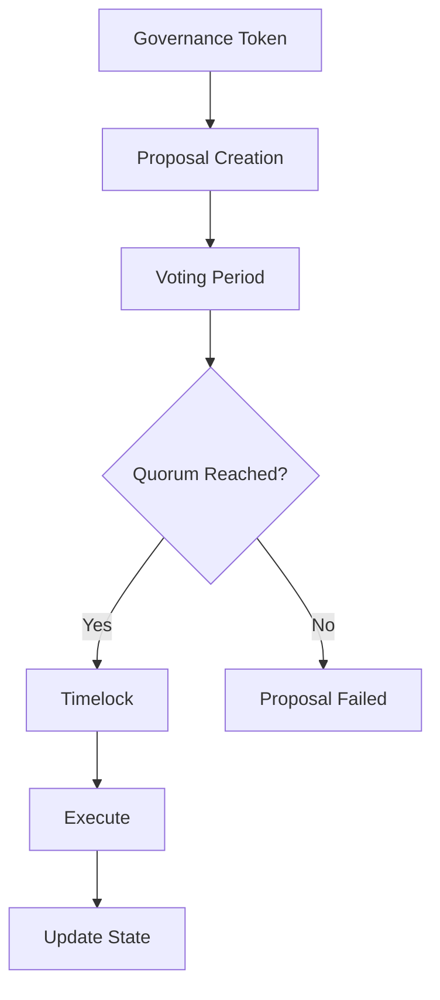

# DAO Governance 🏛️

Decentralized Autonomous Organizations (DAOs) are community-led entities with no central authority, governed by smart contracts and token holders.

## What is a DAO?

A **DAO** is an organization represented by rules encoded as smart contracts, controlled by members through voting.

### Key Components

1. **Treasury**: Funds controlled by DAO
2. **Governance Token**: Voting power
3. **Proposals**: Suggested changes
4. **Voting Mechanism**: Decision making
5. **Execution**: Automated implementation

## DAO Architecture



## Basic DAO Implementation

```solidity
// SPDX-License-Identifier: MIT
pragma solidity ^0.8.0;

import "@openzeppelin/contracts/governance/Governor.sol";
import "@openzeppelin/contracts/governance/extensions/GovernorSettings.sol";
import "@openzeppelin/contracts/governance/extensions/GovernorCountingSimple.sol";
import "@openzeppelin/contracts/governance/extensions/GovernorVotes.sol";
import "@openzeppelin/contracts/governance/extensions/GovernorTimelockControl.sol";

contract MyDAO is 
    Governor,
    GovernorSettings,
    GovernorCountingSimple,
    GovernorVotes,
    GovernorTimelockControl
{
    constructor(
        IVotes _token,
        TimelockController _timelock
    )
        Governor("MyDAO")
        GovernorSettings(
            7200,  // Voting delay (1 day)
            50400, // Voting period (1 week)
            0      // Proposal threshold
        )
        GovernorVotes(_token)
        GovernorTimelockControl(_timelock)
    {}
    
    // Required overrides
    function votingDelay()
        public
        view
        override(IGovernor, GovernorSettings)
        returns (uint256)
    {
        return super.votingDelay();
    }
    
    function votingPeriod()
        public
        view
        override(IGovernor, GovernorSettings)
        returns (uint256)
    {
        return super.votingPeriod();
    }
    
    function quorum(uint256 blockNumber)
        public
        pure
        override
        returns (uint256)
    {
        return 1000e18; // 1000 tokens required
    }
    
    function state(uint256 proposalId)
        public
        view
        override(Governor, GovernorTimelockControl)
        returns (ProposalState)
    {
        return super.state(proposalId);
    }
    
    function propose(
        address[] memory targets,
        uint256[] memory values,
        bytes[] memory calldatas,
        string memory description
    )
        public
        override(Governor, IGovernor)
        returns (uint256)
    {
        return super.propose(targets, values, calldatas, description);
    }
    
    function _execute(
        uint256 proposalId,
        address[] memory targets,
        uint256[] memory values,
        bytes[] memory calldatas,
        bytes32 descriptionHash
    )
        internal
        override(Governor, GovernorTimelockControl)
    {
        super._execute(proposalId, targets, values, calldatas, descriptionHash);
    }
    
    function _cancel(
        address[] memory targets,
        uint256[] memory values,
        bytes[] memory calldatas,
        bytes32 descriptionHash
    )
        internal
        override(Governor, GovernorTimelockControl)
        returns (uint256)
    {
        return super._cancel(targets, values, calldatas, descriptionHash);
    }
    
    function _executor()
        internal
        view
        override(Governor, GovernorTimelockControl)
        returns (address)
    {
        return super._executor();
    }
    
    function supportsInterface(bytes4 interfaceId)
        public
        view
        override(Governor, GovernorTimelockControl)
        returns (bool)
    {
        return super.supportsInterface(interfaceId);
    }
}
```

## Governance Token

```solidity
import "@openzeppelin/contracts/token/ERC20/ERC20.sol";
import "@openzeppelin/contracts/token/ERC20/extensions/ERC20Votes.sol";

contract GovernanceToken is ERC20, ERC20Votes {
    constructor() ERC20("MyDAO Token", "MDAO") ERC20Permit("MyDAO Token") {
        _mint(msg.sender, 1000000e18);
    }
    
    function _afterTokenTransfer(
        address from,
        address to,
        uint256 amount
    ) internal override(ERC20, ERC20Votes) {
        super._afterTokenTransfer(from, to, amount);
    }
    
    function _mint(address to, uint256 amount)
        internal
        override(ERC20, ERC20Votes)
    {
        super._mint(to, amount);
    }
    
    function _burn(address account, uint256 amount)
        internal
        override(ERC20, ERC20Votes)
    {
        super._burn(account, amount);
    }
}
```

## Creating a Proposal

```javascript
import { ethers } from 'ethers';

async function createProposal() {
    const governor = new ethers.Contract(
        DAO_ADDRESS,
        GOVERNOR_ABI,
        signer
    );
    
    // Proposal: Transfer 100 tokens from treasury
    const targets = [TOKEN_ADDRESS];
    const values = [0];
    const calldatas = [
        tokenContract.interface.encodeFunctionData('transfer', [
            RECIPIENT_ADDRESS,
            ethers.utils.parseEther('100')
        ])
    ];
    const description = "Transfer 100 tokens to developer fund";
    
    // Create proposal
    const tx = await governor.propose(
        targets,
        values,
        calldatas,
        description
    );
    
    const receipt = await tx.wait();
    const proposalId = receipt.events[0].args.proposalId;
    
    console.log('Proposal created:', proposalId.toString());
    return proposalId;
}
```

## Voting

```javascript
async function vote(proposalId, support) {
    // support: 0 = Against, 1 = For, 2 = Abstain
    
    // Delegate voting power to self first
    await governanceToken.delegate(await signer.getAddress());
    
    // Vote
    const tx = await governor.castVote(proposalId, support);
    await tx.wait();
    
    console.log('Voted!');
}

async function voteWithReason(proposalId, support, reason) {
    const tx = await governor.castVoteWithReason(
        proposalId,
        support,
        reason
    );
    await tx.wait();
}
```

## Executing Proposals

```javascript
async function executeProposal(
    targets,
    values,
    calldatas,
    descriptionHash
) {
    const governor = new ethers.Contract(
        DAO_ADDRESS,
        GOVERNOR_ABI,
        signer
    );
    
    // Queue proposal (if using timelock)
    await governor.queue(
        targets,
        values,
        calldatas,
        descriptionHash
    );
    
    // Wait for timelock delay
    await new Promise(resolve => setTimeout(resolve, TIMELOCK_DELAY * 1000));
    
    // Execute
    const tx = await governor.execute(
        targets,
        values,
        calldatas,
        descriptionHash
    );
    
    await tx.wait();
    console.log('Proposal executed!');
}
```

## Voting Mechanisms

### 1. Simple Majority

```solidity
// 50% + 1 vote wins
function _quorumReached(uint256 proposalId) internal view returns (bool) {
    ProposalVote storage proposalVote = _proposalVotes[proposalId];
    return proposalVote.forVotes > (totalSupply / 2);
}
```

### 2. Token-Weighted Voting

```solidity
// Voting power = token balance
function getVotes(address account) public view returns (uint256) {
    return token.balanceOf(account);
}
```

### 3. Quadratic Voting

```solidity
// Cost increases quadratically
function castVotes(uint256 proposalId, uint256 numVotes) public {
    uint256 cost = numVotes * numVotes;
    require(votingPower[msg.sender] >= cost, "Insufficient voting power");
    
    votingPower[msg.sender] -= cost;
    votes[proposalId] += numVotes;
}
```

## Advanced Features

### Delegation

```solidity
// Delegate voting power
function delegate(address delegatee) public {
    address delegator = msg.sender;
    address currentDelegate = delegates[delegator];
    
    delegates[delegator] = delegatee;
    
    _moveDelegates(currentDelegate, delegatee, votingPower[delegator]);
}
```

### Snapshot Voting (Off-Chain)

```javascript
// Use Snapshot.js for gasless voting
import snapshot from '@snapshot-labs/snapshot.js';

const client = new snapshot.Client712('https://hub.snapshot.org');

async function createSnapshotProposal() {
    const proposal = {
        space: 'my-dao.eth',
        type: 'single-choice',
        title: 'Proposal Title',
        body: 'Proposal description',
        choices: ['For', 'Against', 'Abstain'],
        start: Math.floor(Date.now() / 1000),
        end: Math.floor(Date.now() / 1000) + 604800,
        snapshot: await provider.getBlockNumber(),
        network: '1',
        strategies: JSON.stringify([{
            name: 'erc20-balance-of',
            params: {
                address: TOKEN_ADDRESS,
                symbol: 'MDAO',
                decimals: 18
            }
        }]),
        plugins: JSON.stringify({}),
        metadata: JSON.stringify({})
    };
    
    const receipt = await client.proposal(signer, signer.address, proposal);
    console.log('Snapshot proposal:', receipt);
}
```

## Treasury Management

```solidity
contract Treasury {
    address public governance;
    
    modifier onlyGovernance() {
        require(msg.sender == governance, "Not governance");
        _;
    }
    
    function spend(
        address token,
        address recipient,
        uint256 amount
    ) external onlyGovernance {
        IERC20(token).transfer(recipient, amount);
    }
    
    function execute(
        address target,
        uint256 value,
        bytes memory data
    ) external onlyGovernance returns (bytes memory) {
        (bool success, bytes memory result) = target.call{value: value}(data);
        require(success, "Execution failed");
        return result;
    }
}
```

## DAO Frameworks

### 1. Aragon

Full-featured DAO platform with UI

### 2. DAOstack

Holographic consensus mechanism

### 3. Colony

Task-based DAO management

### 4. Moloch

Minimal DAO for grants

## Best Practices

1. ✅ **Timelock**: Delay execution for security
2. ✅ **Quorum**: Require minimum participation
3. ✅ **Delegation**: Enable vote delegation
4. ✅ **Transparency**: Detailed proposals
5. ✅ **Emergency Pause**: Safety mechanism
6. ✅ **Multi-sig**: Backup governance
7. ✅ **Progressive Decentralization**: Start centralized

## Common Challenges

- **Low Voter Turnout**: Incentivize participation
- **Whale Control**: Quadratic voting, caps
- **Governance Attacks**: Timelock, quorum
- **Proposal Spam**: Proposal threshold
- **Execution Delays**: Balance security & speed

## Resources

- [OpenZeppelin Governor](https://docs.openzeppelin.com/contracts/governance)
- [Snapshot](https://snapshot.org/)
- [Tally](https://www.tally.xyz/)
- [Boardroom](https://boardroom.io/)

**Next**: [MEV & Flash Loans](mev-flashloans.md) →
