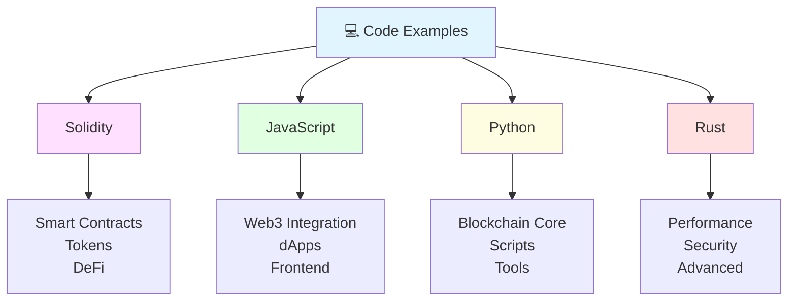
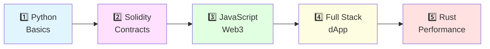

# Code Examples 💻

Welcome to the code examples section! Here you'll find practical, working code snippets and complete projects in multiple programming languages to help you learn blockchain development.



## 📁 Directory Structure

```
code-examples/
├── solidity/          # Smart contract examples
│   ├── SimpleToken.sol
│   ├── NFT.sol
│   ├── DEX.sol
│   └── DAO.sol
├── javascript/        # Web3 and frontend examples
│   ├── connect-wallet.js
│   ├── interact-contract.js
│   ├── nft-minter.js
│   └── defi-dashboard.js
├── python/           # Blockchain core and scripts
│   ├── simple_blockchain.py
│   ├── merkle_tree.py
│   ├── wallet.py
│   └── mining.py
└── rust/             # Performance-critical implementations
    ├── blockchain.rs
    ├── consensus.rs
    └── p2p.rs
```

## 🔤 Solidity Examples

### 1. SimpleToken.sol 🪙
**What it does**: Basic ERC-20 token implementation

**Features**:
- ✅ Token transfers
- ✅ Approval mechanism
- ✅ Balance tracking
- ✅ Events and logging

**Usage**:
```solidity
// Deploy the contract
SimpleToken token = new SimpleToken("My Token", "MTK", 18, 1000000);

// Transfer tokens
token.transfer(recipient, 100);

// Approve spending
token.approve(spender, 500);
```

**Learn More**: [Solidity Basics](../04-smart-contracts/solidity-basics.md)

### 2. NFT.sol 🎨
**What it does**: ERC-721 NFT implementation

**Features**:
- ✅ Mint unique tokens
- ✅ Metadata URI
- ✅ Ownership tracking
- ✅ Transfer mechanics

### 3. DEX.sol 🔄
**What it does**: Simple decentralized exchange

**Features**:
- ✅ Token swaps
- ✅ Liquidity pools
- ✅ Price calculation
- ✅ Fee mechanism

### 4. DAO.sol 🏛️
**What it does**: Governance contract

**Features**:
- ✅ Proposal creation
- ✅ Voting system
- ✅ Execution logic
- ✅ Treasury management

## 🟨 JavaScript Examples

### 1. connect-wallet.js 🦊
**What it does**: Connect to MetaMask and other wallets

**Features**:
- ✅ MetaMask connection
- ✅ Network switching
- ✅ Account management
- ✅ Event listeners

**Usage**:
```javascript
// Connect to MetaMask
const wallet = await connectMetaMask();
console.log('Connected:', wallet.address);

// Get balance
const balance = await wallet.provider.getBalance(wallet.address);
console.log('Balance:', ethers.formatEther(balance), 'ETH');
```

**Dependencies**:
```bash
npm install ethers@6
```

### 2. interact-contract.js 📜
**What it does**: Read and write to smart contracts

**Features**:
- ✅ Contract instantiation
- ✅ Read contract state
- ✅ Send transactions
- ✅ Event listening

**Usage**:
```javascript
// Read contract data
const name = await contract.name();
const balance = await contract.balanceOf(address);

// Write to contract
const tx = await contract.transfer(recipient, amount);
await tx.wait();
```

### 3. nft-minter.js 🖼️
**What it does**: Mint NFTs with metadata

**Features**:
- ✅ IPFS integration
- ✅ Metadata upload
- ✅ Batch minting
- ✅ Progress tracking

### 4. defi-dashboard.js 💰
**What it does**: DeFi protocol interaction

**Features**:
- ✅ Token swaps
- ✅ Liquidity provision
- ✅ Yield farming
- ✅ Portfolio tracking

## 🐍 Python Examples

### 1. simple_blockchain.py ⛓️
**What it does**: Complete blockchain implementation

**Features**:
- ✅ Block creation
- ✅ Proof of work mining
- ✅ Transaction handling
- ✅ Chain validation

**Usage**:
```python
# Create blockchain
blockchain = Blockchain(difficulty=2)

# Add transaction
tx = Transaction("Alice", "Bob", 50)
blockchain.add_transaction(tx)

# Mine block
blockchain.mine_pending_transactions("Miner1")

# Check balance
balance = blockchain.get_balance("Alice")
print(f"Alice's balance: {balance}")
```

**Run it**:
```bash
python simple_blockchain.py
```

**Output**:
```
🚀 SIMPLE BLOCKCHAIN DEMONSTRATION
✅ Genesis block created!
✅ Transaction added: Alice -> Bob: 50
⛏️  Mining block 1...
✅ Block mined: 00a1b2c3d4e5...
💰 Alice's balance: -50
💰 Bob's balance: 50
💰 Miner1's balance: 100
```

### 2. merkle_tree.py 🌳
**What it does**: Merkle tree implementation

**Features**:
- ✅ Tree construction
- ✅ Proof generation
- ✅ Proof verification
- ✅ Visualization

### 3. wallet.py 👛
**What it does**: Simple HD wallet

**Features**:
- ✅ Key generation
- ✅ Address derivation
- ✅ Transaction signing
- ✅ Mnemonic support

### 4. mining.py ⛏️
**What it does**: Mining simulation

**Features**:
- ✅ Hash calculation
- ✅ Difficulty adjustment
- ✅ Performance metrics
- ✅ Mining pool simulation

## 🦀 Rust Examples

### 1. blockchain.rs ⛓️
**What it does**: High-performance blockchain

**Features**:
- ✅ Fast block processing
- ✅ Concurrent validation
- ✅ Memory efficient
- ✅ Production ready

### 2. consensus.rs ⚙️
**What it does**: Consensus mechanisms

**Features**:
- ✅ PoW implementation
- ✅ PoS implementation
- ✅ BFT algorithms
- ✅ Benchmarking

### 3. p2p.rs 🌐
**What it does**: Peer-to-peer networking

**Features**:
- ✅ Node discovery
- ✅ Message propagation
- ✅ Network sync
- ✅ Peer management

## 🚀 Quick Start Guides

### Solidity Development

1. **Install Hardhat**:
```bash
npm install --save-dev hardhat
npx hardhat
```

2. **Compile contracts**:
```bash
npx hardhat compile
```

3. **Deploy locally**:
```bash
npx hardhat node
npx hardhat run scripts/deploy.js --network localhost
```

### JavaScript Development

1. **Install dependencies**:
```bash
npm install ethers@6
```

2. **Run example**:
```bash
node connect-wallet.js
```

3. **Build dApp**:
```bash
npm create vite@latest my-dapp -- --template react
cd my-dapp
npm install ethers
```

### Python Development

1. **Install dependencies**:
```bash
pip install web3 eth-account cryptography
```

2. **Run blockchain**:
```bash
python simple_blockchain.py
```

3. **Interact with Ethereum**:
```bash
python interact_ethereum.py
```

### Rust Development

1. **Install Rust**:
```bash
curl --proto '=https' --tlsv1.2 -sSf https://sh.rustup.rs | sh
```

2. **Create project**:
```bash
cargo new my-blockchain
cd my-blockchain
```

3. **Run example**:
```bash
cargo run
```

## 📚 Learning Path



### Beginner Path 🌱
1. Start with **Python** blockchain basics
2. Learn **Solidity** smart contracts
3. Connect with **JavaScript** Web3
4. Build your first dApp

### Intermediate Path 🚀
1. Advanced **Solidity** patterns
2. **JavaScript** frontend frameworks
3. **Python** automation scripts
4. Deploy to testnet

### Advanced Path 🏆
1. **Rust** blockchain implementation
2. Optimize gas costs
3. Security auditing
4. Production deployment

## 🛠️ Development Tools

### IDEs & Editors
- **VS Code** with Solidity extension
- **Remix IDE** for quick testing
- **PyCharm** for Python
- **IntelliJ IDEA** for Rust

### Testing Frameworks
- **Hardhat** for Solidity
- **Foundry** for advanced testing
- **Jest** for JavaScript
- **pytest** for Python

### Debugging Tools
- **Hardhat Console** for contracts
- **Browser DevTools** for Web3
- **pdb** for Python
- **rust-gdb** for Rust

## 💡 Best Practices

### Solidity 📝
```solidity
// ✅ DO: Use checks-effects-interactions
function withdraw(uint amount) public {
    require(balances[msg.sender] >= amount);
    balances[msg.sender] -= amount;  // Effect
    payable(msg.sender).transfer(amount);  // Interaction
}

// ❌ DON'T: External calls before state changes
function withdrawBad(uint amount) public {
    payable(msg.sender).transfer(amount);  // ❌ First
    balances[msg.sender] -= amount;  // ❌ Then update
}
```

### JavaScript 🟨
```javascript
// ✅ DO: Handle errors properly
try {
    const tx = await contract.transfer(to, amount);
    await tx.wait();
    console.log('Success!');
} catch (error) {
    console.error('Transaction failed:', error);
}

// ❌ DON'T: Ignore errors
contract.transfer(to, amount);  // ❌ No error handling
```

### Python 🐍
```python
# ✅ DO: Validate inputs
def transfer(self, to: str, amount: float) -> bool:
    if not self.is_valid_address(to):
        raise ValueError("Invalid address")
    if amount <= 0:
        raise ValueError("Amount must be positive")
    # ... rest of logic

# ❌ DON'T: Skip validation
def transfer_bad(self, to, amount):
    self.balances[to] += amount  # ❌ No checks
```

## 🎓 Exercises

### Beginner 🌱

1. **Modify SimpleToken.sol**
   - Add burn function
   - Implement mint function
   - Add pause/unpause

2. **Enhance connect-wallet.js**
   - Add WalletConnect support
   - Show token balances
   - Display transaction history

3. **Extend simple_blockchain.py**
   - Add transaction fees
   - Implement wallet addresses
   - Create mining pool

### Intermediate 🚀

4. **Build NFT Marketplace**
   - Minting interface
   - Listing mechanism
   - Buy/sell functionality

5. **Create DEX Interface**
   - Swap tokens
   - Add liquidity
   - Show prices

6. **Develop DAO**
   - Proposal system
   - Voting mechanism
   - Treasury management

### Advanced 🏆

7. **Implement Layer 2**
   - Rollup contract
   - State channels
   - Fraud proofs

8. **Build MEV Bot**
   - Arbitrage detection
   - Flash loans
   - Gas optimization

9. **Create Cross-Chain Bridge**
   - Lock/unlock mechanism
   - Validator network
   - Security model

## 🔗 External Resources

### Documentation
- [Solidity Docs](https://docs.soliditylang.org/)
- [Ethers.js Docs](https://docs.ethers.org/)
- [Web3.py Docs](https://web3py.readthedocs.io/)
- [Rust Ethereum](https://ethereum.org/en/developers/docs/programming-languages/rust/)

### Tutorials
- [CryptoZombies](https://cryptozombies.io/)
- [Solidity by Example](https://solidity-by-example.org/)
- [Scaffold-ETH](https://scaffoldeth.io/)
- [Speed Run Ethereum](https://speedrunethereum.com/)

### GitHub Repos
- [OpenZeppelin Contracts](https://github.com/OpenZeppelin/openzeppelin-contracts)
- [Uniswap V3 Core](https://github.com/Uniswap/v3-core)
- [Aave Protocol](https://github.com/aave/aave-v3-core)

## ⚠️ Security Warnings

🚨 **Important**: These examples are for educational purposes only!

- ❌ **DO NOT** use in production without audits
- ❌ **DO NOT** deploy with real funds
- ❌ **DO NOT** share private keys
- ✅ **DO** test on testnets first
- ✅ **DO** get professional audits
- ✅ **DO** follow best practices

## 🤝 Contributing

Want to add your own examples?

1. Fork the repository
2. Create a new branch
3. Add your example with documentation
4. Submit a pull request

**Guidelines**:
- Include clear comments
- Add usage examples
- Write tests
- Follow coding standards

---

**🎯 Start Coding**: Pick a language and start building!

**💬 Questions**: Join our Discord community for help
